-----------

We saw at the beginning that some stars appear to change their brightness over time, either periodically or in sudden events. In this section we will look at the different types of variability and how we can explain them with our understanding of stellar physics. We will see that variable stars can be valuable sources of information that is difficult to get any other way.

## Variable Stars Introduction

- By ‘variable’ we mean that the star’s flux changes with time
- We observe this by measuring changes in apparent magnitude
- It can be a real variation because the star itself changes or an apparent variation e.g. something moves in front of the star and blocks its light fully, or partially, from us
- The variation can be _irregular_ or _regular_

# Irregular variable stars

## Irregular variable stars: Novae

- Novae are sometimes called cataclysmic variables
- They flare in brightness irregularly, sometimes only once
- Their luminosity may increase by a factor of 1000 over a period of ~ a week and then decay slowly
- All novae exist in binary systems in which material is transferred from one star to the other causing a bright outburst

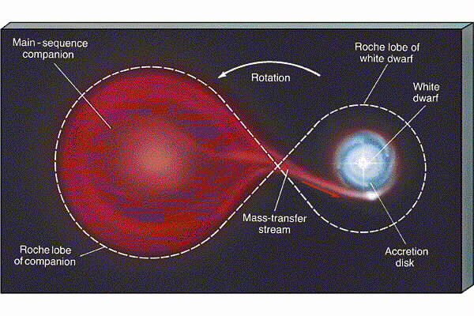

## Irregular Variable Stars: T Tauri Stars

This is a class of irregular variable stars named after their prototype : T Tauri in the constellation of Taurus
- Their luminosity increases by a factor of three in a few days
- T Tauri stars are very young stars – _protostars_ that are powered by gravitational energy as they contract and move towards the Main Sequence
- We will see where they fit into stellar evolution later

## Irregular Variable Stars: Type II Supernovae

- The end state of a very massive star
- After nuclear fuel is exhausted, the core collapses and the outer layers are blown off
- A small dense neutron star remains, surrounded by expanding spheres of circumstellar matter

We will study these in detail when we revisit the end stages of stellar evolution

### Supernova 1987a

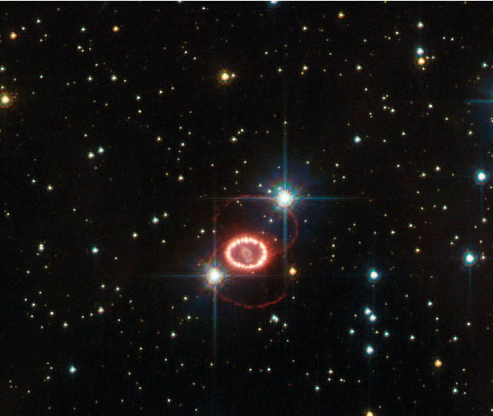

- SN1987a is the closest supernova of modern times
- Exploded on February 23, 1987 in the Large Magellanic Cloud
- Because of its closeness – only 168,000 light years – SN 1987A is the best-studied supernova of all time

## Irregular Variable Stars : Type Ia Supernovae

In 2014 an example of such a Type Ia supernova (SN2014J) was seen in M82 – 11.4 million light years from us
- This was the brightest SN seen since SN1987A
- We would only expect one such Type 1a SN in M82 every few decades

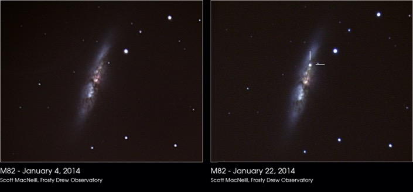

## Supernovae - types?

Supernovae are classified according to observational features
- We will learn how to classify them in part 2.1
- Type Ia supernovae are important because they all have nearly equal brightness
- They are "standard candles" which can be used to measure distance
- This is used for cosmology!

# Regular Variable Stars

Regular variables exhibit flux variations that follow a regular repeating pattern
- Examples are: RR Lyrae, Miras, Cepheids

We will look more closely at Cepheids
Named after the star d Cephei which was first observed in 1786.

# Cepheid Variable Stars

Cepheids are very luminous giant or supergiant stars.
- Luminosity varies by factors of up to ten
- Depending on the star, this variation repeats over periods between 1 and 100 days.
- Example: Polaris (the Pole Star) has a period of about 4 days and changes its luminosity by about 5% over that period

## V-band apparent magnitude of Polaris

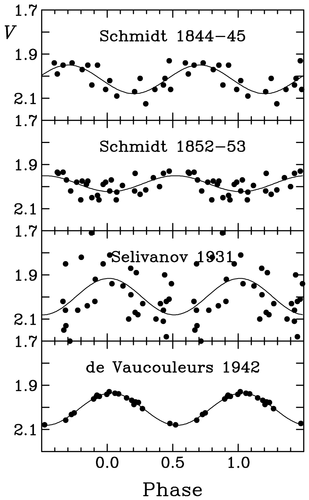

Image credit: Turner _et al_, Period Changes of Polaris, Publications of the Astronomical Society of the Pacific,  Vol. 117 No. 828 (2005)

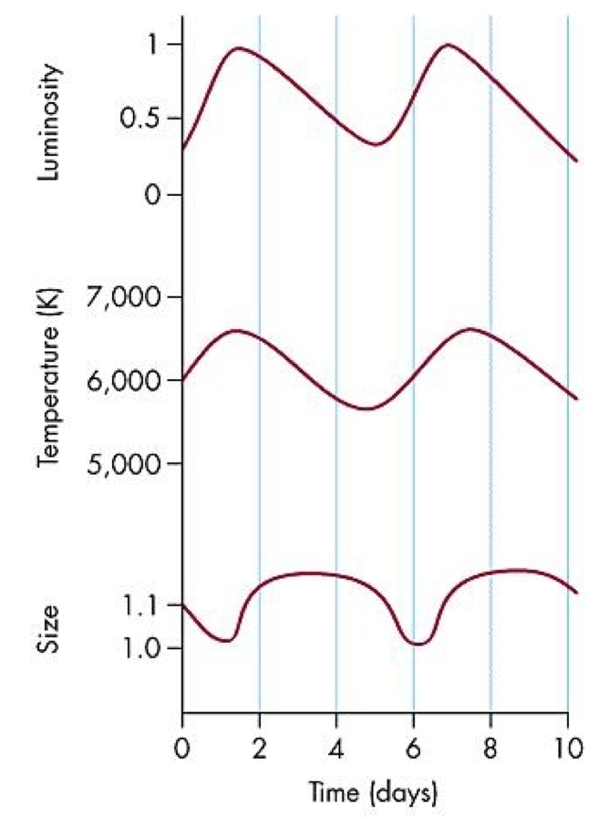
Cepheid variables pulsate with a very regular period.
Radial pulsation results in a regular pulsation of

- velocity of the star's surface
- Effective Temperature
- Luminosity

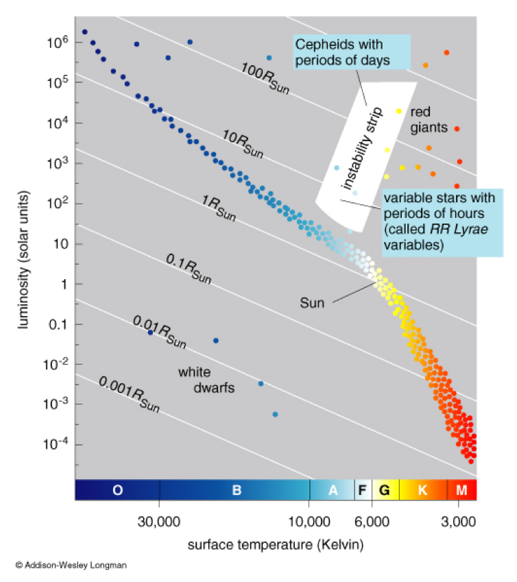

- Cepheid variables sit in a region of the HR diagram called the _instability strip_
- Lies at roughly right-angles to the main sequence, toward the direction of the Giant branch

## Cepheid Period-Luminosity relation
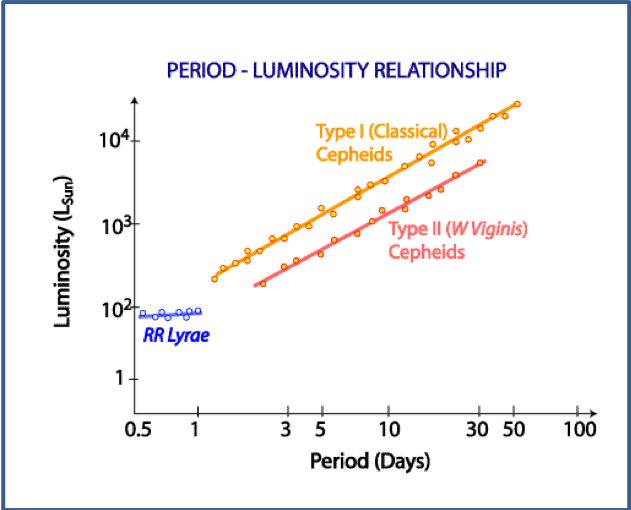

- For cepheids the period of the pulsation depends only on the average luminosity of the star.
- The longer the pulsation period $P$, the more luminous the star
- There are two types, with period-magnitude relations
 - $M=-(1.8 + 2.4\log_{10} P)$ (Type I - massive, young cepheids)
 - $M=-(0.4 + 2.4\log_{10} P)$ (Type II - older, smaller cepheids)
- Where $P$ is the period in days, and $M$ is the absolute magnitude of the star.

## Cepheid Variable Stars as distance indicators

If you observe a Cepheid and measure its period of oscillation then you can find the intrinsic luminosity from the period-luminosity relationship
- You can measure the flux $F$ from the Cepheid
- You know how flux is related to luminosity $L$: $$F=\frac{L}{4\pi D^2}$$

 
Therefore, you can calculate the distance, $D$ , to the Cepheid

# Binary stars

Stars are often found in pairs, at least half the "stars" we see are actually binary systems with two stars orbiting around each other. Since we know the laws of orbital motion this gives us a great new avenue to explore what we can learn about these stars from the observations. They can give us some direct measurements of mass that are hard to come by without the mass-luminosity relationship.

4 main classes of binaries

- Visual binaries – where with telescopes it is possible to resolve the two components
- Astrometric binaries – where we cannot resolve the individual stars but where we see a periodic wobble of the observed overall position
- Spectroscopic – where the components are not resolvable but where Doppler shifts in their spectral lines reveal that there are two stars orbiting their centre of mass
- Eclipsing binaries – where we cannot resolve the individual stars but where we see a periodic brightening and dimming

## Visual Binaries

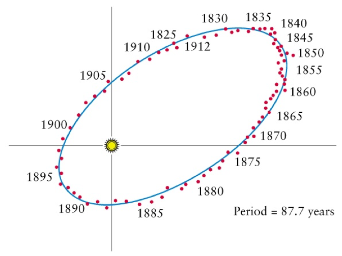

Visual binaries tend to be relatively near to us
Otherwise we could not resolve the components
- ~1000 visual binaries have been identified
- long-term (many year) observations may be needed to establish the orbit
- A good example is 70 Ophiuchi (right): you need to be patient!

## Astrometric binaries

If one of the stars is much brighter than the other, it might be possible to only see one of them.
The presence of a binary companion can be deduced from the apparent wobble of the star as it moves in its elliptical orbit. This situation is described as an __astrometric binary__.

## Binary systems - orbital analysis

We know how to analyse orbits of planets in our solar system or satellites round the Earth
For these cases one mass is huge compared to the other, so we approximate and deal with the orbit as if the larger mass is stationary.

Treatment of the dynamics of binary systems is only slightly harder because the masses of the components can be more comparable
In such a binary system, the stars orbit about their centre of mass – a point in between them

Newton and Kepler's laws still apply:
- The centre of mass does not move (Newton 1)
- Orbital motion is in a plane (conservation of angular momentum)
- Both bodies feel the same attractive force, $F=\frac{GM_1M_2}{r^2}$
- Orbits are ellipses, with the centre of mass at one focus (Kepler 1)

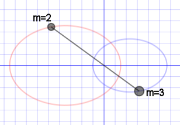

A line between the two stars always passes through the centre of mass.
If the masses are equal, the centre of mass is half way between them.

If the two masses are different, the centre of mass is closer to the heavier object.

$$ \frac{m_1}{m_2} = \frac{r_2}{r_1} = \frac{a_2}{a_1}$$

where $a$ is the semi-major axis of the ellipse.

Kepler's laws of orbital motion apply to the orbits of both stars about the centre of mass:

$$P^2 = \frac{4\pi^2}{G(m_1+m_2)}(a_1+a_2)^3$$

(Note that the total mass $m_1+m_2$ appears, where if $m_1\gg m_2$ one can be neglected in the planetary motion form of the law - c.f. Dynamical Astronomy)

- If we measure the period $P$, and the angular separation of the stars, and the distance to the binary is known, then we can find the semi-major axis
- This allows us to find the total mass of the system $m_1+m_2$
- This is simple for a face-on binary but in general one has to also measure the inclination

- Centre of mass dynamics tells us $m_1a_1 = m_2a_2$.
- For visual binaries, we can measure both $a_1$ and $a_2$, so we can find $m_1/m_2$
- Since we also know the total mass, this means we can deduce the individual masses $m_1$ and $m_2$

$$m_1 = \frac{(m_1+m_2)r_2}{r_1+r_2}\quad m_2=\frac{(m_1+m_2)r_1}{r_1+r_2}$$

- Determination of mass is a key result from binary star observations

## Spectroscopic binaries

If the stars are too close together to resolve separately, we can still deduce whether the system is a binary by measuring spectral lines. Light from each star is doppler shifted as they move toward and away from us.

- When a star is moving away from us, its light is shifted toward the red end of the spectrum (redshifted)
- When a star is moving toward us, its light is shifted toward the blue end of the spectrum (blueshifted)

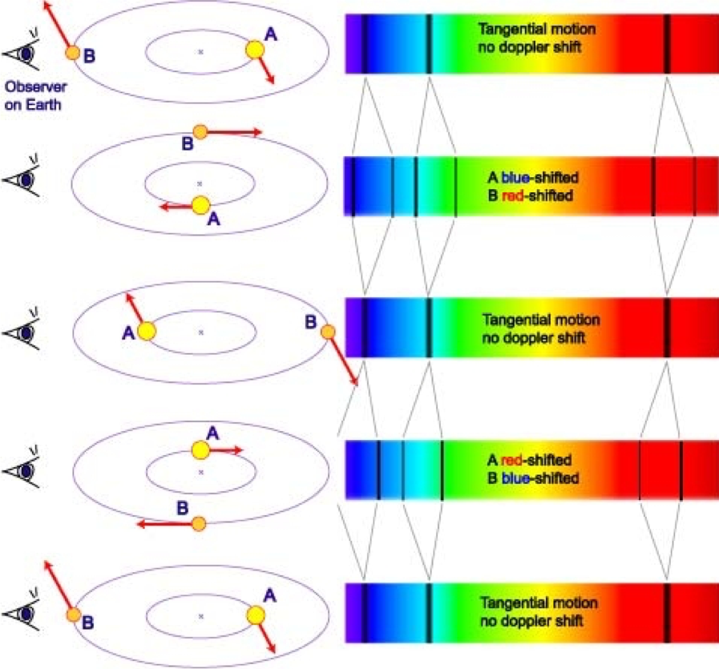

The speed toward and away from us is reduced by the inclination of the orbital plane.
$$ v= v_{true} \sin\iota$$
where $\iota$ is the __inclination angle__ between the orbital angular momentum vector and our line of sight.

For a spectral line with wavelength $\lambda_0$ in the reference frame of the star, the doppler shift causes a shift of size $\delta\lambda$.

$$\frac{\delta\lambda}{\lambda_0}=\frac{v}{c}$$
where $v$ is the speed of the source toward or away from us along the line of sight.

Our knowledge of dynamics tells us that

$$\frac{v_1}{v_2}=\frac{a_1}{a_2}=\frac{m_2}{m_1}$$

- The $\sin\iota$ term from inclination cancels out!

- In order to find the individual masses we need a way to measure $m_1+m_2$ as before.
- Remember that $v_1=r_1\omega$ and $v_2 = r_2\omega$.
- The angular frequency $\omega = 2\pi/P$
- So we can write
    $$v_1+v_2 = \frac{2\pi a}{P}$$
- And so
    $$m_1+m_2 = \frac{P}{2\pi G}(v_1+v_2)^3$$

Unfortunately, the $\sin\iota$ term doesn't cancel out here. If we don't precisely know the inclination then we have an uncertainty on the total mass
- So we are limited in our ability to deduce the individual masses

## Eclipsing binaries

- Eclipsing binaries are a type of regular variable star
- The presence of a binary can be deduced by measureing the light curve (magnitude over time)

- The stars will eclipse each other only if we are viewing the system near edge-on ($\iota \approx 90^\circ$)
- So we can safely assume that we know the inclination
- If we can also measure the doppler shift spectroscopically, then we can measure the individual masses using the spectroscopic method

## Which eclipse is which?

Which eclipse will produce the greater reduction in the brightness (primary minimum)?

We can write the flux from each star as $$F_1=\frac{4\pi r_1^2 \sigma T_1^4}{4\pi d^2}$$ $$F_2=\frac{4\pi r_2^2 \sigma T_2^4}{4\pi d^2}$$. Assume for now that $r_1>r_2$, i.e. star 1 is bigger.

- Consider the flux received:
 - When both stars are visible, $F_0 = F_1 + F_2$
 - When 2 moves behind 1, the flux is $F = F_1$
 - When 1 moves behind 2, the flux is
 
\begin{align}
F' &= F_1(1-\frac{r_2^2}{r_1^2}) + F_2 \\
  & = \frac{4\pi r_1^2 \sigma T_1^4}{4\pi d^2}(1-\frac{r_2^2}{r_1^2}) + \frac{4\pi r_2^2 \sigma T_2^4}{4\pi d^2} \\
  & = \frac{\sigma}{d^2}\left((r_1^2-r_2^2)T_1^4 + r_2^2T_2^4\right) \\
  &= \frac{\sigma}{d^2}\left(r_1^2T_1^4 + r_2^2(T_2^4 - T_1^4)\right)
\end{align}

- If $T_2>T_1$, then $F' > F_1$: secondary minimum
- If $T_2<T_1$, then $F' < F_1$: primary minimum

## Primary and secondary minima

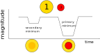

- At the primary minimum, the hotter star moves behind the cooler
- At the secondary minimum the cooler star moves behind the hotter

The smaller star obscures a chunk of the larger, but it adds its own light. If it is higher temperature then it will be replaced by a brighter patch.

It can be shown that if
- F_0 is the flux when no eclipse is happening
- F_p is the primary eclipse flux
- F_s is the secondary eclipse flux

$$\frac{F_0 - F_p}{F_0 - F_s} = \left(\frac{T_2}{T_1}\right)^4$$

where $T_1$ is the temperature of the larger star, and $T_2$ the smaller.
We can find the ratio of the temperatures.

So in eclipsing, spectroscopic binaries we can get
- The orbital period (from either light curve or spectroscopy)
- Speed of the stars in orbit (from spectroscopy), which can be used to find the size of the orbit
- There is enough information to calculate the mass of the two stars

The light curve gives us even more information, allowing us to compute the size of each star!
This can be done by measuring the time of the transit, and combining with the speed measured via doppler line shift.

