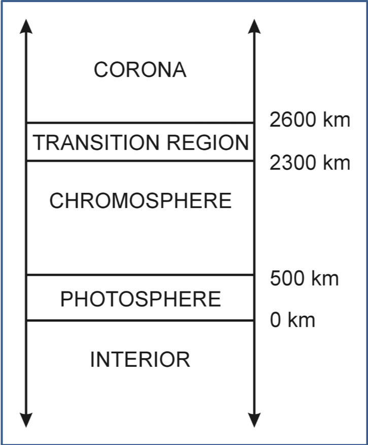
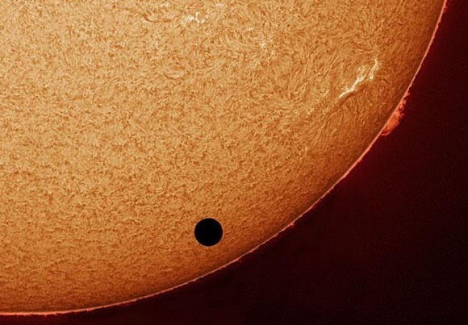
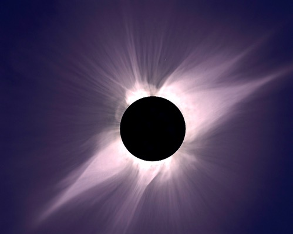
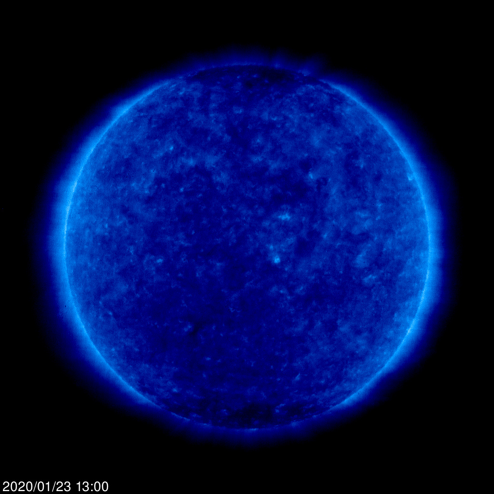
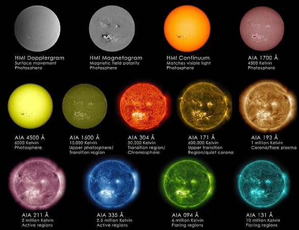
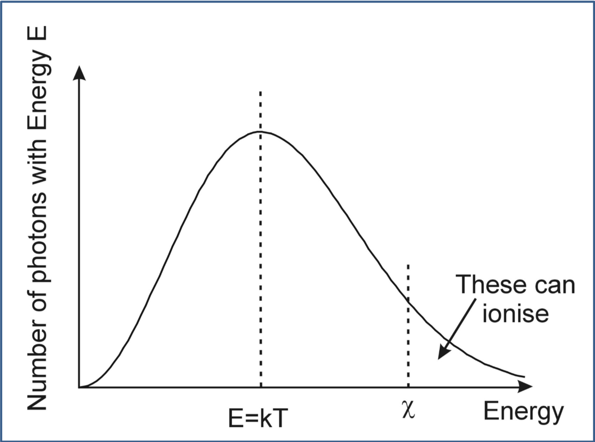
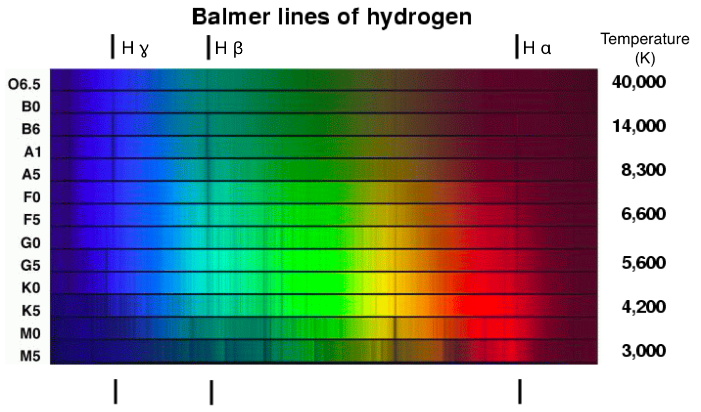

-----------

So far we have thought of at stars as simplified balls of hot gas. In this part we will start to invetigate the composition and structure of stars. As we have seen, there are dark lines in the spectra of stars that can reveal their composition.

# Vogt-Russell Theorem

The structure of a star, in hydrostatic and thermal equilibrium, with all energy derived from nuclear reactions, is uniquely determined by its mass and the distribution of chemical elements throughout its interior.

__Spectroscopy__ is the method for identifying the elements by their spectral lines.

Remember Kirchoff's Laws from part 2:

- __1.__ A hot and opaque solid, liquid or highly compressed gas emits a continuous blackbody as-named by Kirchhoff spectrum with no spectral lines 
- __2.__ A hot, transparent gas, illuminated by a continuum source, produces a spectrum of bright emission lines
- __3.__ If a continuous spectrum passes through a transparent gas at a lower temperature, the cooler gas will absorb at characteristic wavelengths resulting in dark absorption lines

Kirchoff's laws tell us that the absorption lines indicate the presence of a cooler layer of diffuse gas, on top of a hot layer of denser gas.

# The Sun's atmosphere

{#fig-sun-atmosphere-scheme}

When we observe the Sun, we see light from:

- The Photosphere
- The Chromosphere
- The Corona

in descending order of contribution.

## The Photosphere

The Sun has no solid surface but becomes opaque to visible light at the photosphere.

The photosphere is about 500 km thick and temperature, T , varies throughout.
- $T_{base} \approx 6500 \mathrm{K}$
- $T_{top} \approx 4400 \mathrm{K}$
 
 
Most of the light comes from a region where the temperature  $T \approx 5800$ K, where the density is about one thousandth that of air.

So the Sun is not a perfect black-body with a single temperature.

- What do you notice?



- The Photosphere is marked by bright, bubbling granules of plasma, and darker, cooler sunspots
- sunspots are NOT really cool, just about 1500K cooler than the rest of the photosphere
- Sunspots appear to move across the Sun’s disk, showing us that the Sun is actually rotating
- The Sun is a ball of gas, not a solid, and different regions rotate at different rates
- the Sun’s equatorial regions rotate in about 24 days
- the polar regions take more than 30 days

- Solar flares - extending hundreds of thousands of miles above the surface - originate in the photosphere
- These flares produce bursts of radiation across the electromagnetic spectrum, from X-rays, to radio waves

## The Chromosphere

Image credit: http://antwrp.gsfc.nasa.gov/apod/ap040611.html

- We get only a little light from the chromosphere – the next layer of gas
- The chromosphere is seen as a dim reddish-pink glow from super-heated Hydrogen
- The glow is only really seen during an eclipse
- At other times, light from the chromosphere is usually too weak to be seen against the brighter photosphere
- The chromosphere is about 2000 km thick
- It is hottest furthest from the Sun : $T \approx 20000$ K

## The Corona

- Very hot : $T\approx 10^6$ K
- Outer atmosphere, extending as far as $\approx 3 R_\odot$
- Again, only really seen visually from Earth during an eclipse
- Together with the chromosphere, it contributes about $10^{-4} L_\odot$
- Very diffuse and eventually leads to the Solar Wind
    - the solar wind stretches out to about 100 AU
    - its effect is seen on Earth as the Aurora

## The Sun in extreme Ultra-violet light

This image from SOHO highlights temperatures of ~1 MK.

## Solar activity: our not-so-quiet star


## Solar flares can produce aurora

The aurora borealis over Alaska

## Different wavelength light can reveal different structures in the solar atmosphere

# Spectroscopy

- Each chemical element has its unique spectral line fingerprint
- From a measurement of its spectrum, the pattern of lines seen allows identification of the elements in a star’s atmosphere
- Strengths of the spectral lines tells us about stellar temperature; line strength depends on
    - number of atoms present
    - temperature of the gas

## Doppler shifts

- Wavelengths and ‘widths’ of lines are affected by Doppler shifts due to the motion of the stellar atmosphere
    - Effects on lines due to bulk motions allow measurement of overall rotation and large-scale expansion or contraction (e.g.: Cepheids)
    - Effects on lines due to random thermal motions of atoms in the atmosphere allow measurement of temperature and pressure
- But it can be hard to disentangle all of these!

## Atomic absorption lines

We really need Quantum Mechanics to accurately understand spectral lines
- However we can simplify using the Bohr Model
- This works well for hydrogen, and sometimes for other elements too
- Since most of the Sun is Hydrogen we will stick to the simple picture

## The Bohr Model

- Electrons, bound in atoms, are only allowed certain energies
- These energies correspond to certain ‘orbits’ around the nucleus
- These orbits must have angular momenta equal to an integer multiple of a universal constant – Planck’s constant
- Only photons with energies corresponding to differences between energy levels can be emitted or absorbed

## Energy levels

- Electrons, bound in atoms, are only allowed certain energies
- These energies correspond to certain ‘orbits’ around the nucleus
- These orbits must have angular momenta equal to an integer multiple of a universal constant – Planck’s constant
- Only photons with energies corresponding to differences between energy levels can be emitted or absorbed

The energy of the n-th level of hydrogen
$$E\propto -\frac{1}{n^2}$$

- So for a transition between level $m$ (higher energy state) and level $n$ (a lower energy state) a photon would be emitted of energy corresponding to the energy difference between the states
$$\delta E_{mn} \propto  \left(\frac{1}{n^2} - \frac{1}{m^2}\right)$$

From quantum theory we can relate the energy to the wavelength: $\Delta E_{mn} = \frac{hc}{\lambda_{mn}}$.

So this means we can calculate the wavelength of the emitted photon:
$$\frac{1}{\lambda_{mn}} = R_\infty \left(\frac{1}{n^2} - \frac{1}{m^2}\right)$$

All the constants are hidden in $R_\infty$. This equation is the __Rydberg Equation__.

$R_\infty = 1.097\times 10^{7}\,m^{-1}$ is the __Rydberg constant__.

- Depending on the values of m and n , we can calculate the characteristic wavelengths (of the lines) corresponding to several series of transitions
- When doing calculations remember that the result for wavelength must be positive; so make sure that you use n < m to get a positive result

## Series of lines in Hydrogen

In Hydrogen some of the transitions have special names:

__Lyman Series__ (Ly): Transitions from excited states $m>1$ to the ground state ($n=1$)
- Ly$\alpha$: m=2 to n=1
- Ly$\beta$: m=3 to n=1
- etc

__Balmer Series__ (H): Transitions from $m>2$ to $n=2$
- H$\alpha$: m=3 to n=2
- H$\beta$: m=4 to n=2
- etc

__Emission__

- electron drops to a lower level
- photon is emitted, of energy corresponding to the energy difference between the transition levels

__Absorption__
- electron jumps to a higher level
- photon of the correct energy – corresponding to the energy level difference – is needed for this to happen

## Spectral lines in the light from the Sun

Strongest visible line from solar hydrogen is H$\alpha$
- We see this in absorption in the chromosphere
- We see other atoms in absorption :
    - hydrogen, helium, magnesium, sodium, iron, chromium …
- There are about 250,000 lines in total
- Identify by heating elements in the lab and observing spectra

__Will H$\alpha$ absorption happen?__

H$\alpha$ absorption involves an electron going from from $n = 2$ to $m = 3$
- i.e. the electron must already be in an excited state!

The electron gets from the ground state ($n=1$) to the $n = 2$ state by thermal excitation
- The chances of this depend on the Boltzmann factor

### Boltzmann factor
The probability of an electron occupying energy state E is :
$$P(E) \propto \exp\left(-\frac{E}{k_B T}\right)$$

here $k_B = 1.381\times 10^{-23}\, \mathrm{JK}^{-1}$ is Boltzmann’s constant

The minus sign in the exponential tells us that states with $E\gg k_BT$ are very improbable

## Energy level occupation

We know that
- 2 electrons can occupy the $n = 1$ shell
- 8 electrons can occupy the $n = 2$ shell

If there are 8 possible states in the n=2 shell there is 8 times the probability of finding an electron there.

So we can calculate the ratio of the population of atoms in the two states from :

$$\frac{N_2}{N_1}=\frac{8\exp(-E_2/k_BT)}{2\exp(-E_1/k_BT)}= \frac{8}{2}\exp -\frac{\Delta E_{21}}{k_BT}$$

Here  $\Delta E_{21}$  is the energy difference between the n = 1 and n = 2 states

## $\Delta E$ for Hydrogen lines

For Ly$\alpha$ we have

$$\Delta E_{21} = h\nu_{21} = hc/\lambda_{21}$$

$$\Delta E_{21} = hcR_\infty\left(\frac{1}{1^2}-\frac{1}{2^2}\right)= 1.64\times 10^{-18}\,\mathrm{J}$$

## What fraction of atoms are in the $n=2$ state?

For $T=6000$K, we find:
$$\frac{N_2}{N_1} \approx 10^{-8}$$

- i.e. 99,999,999  out of every 100 million hydrogen atoms is in the ground state

So this transition is very unlikely at this temperature
- We still see this line though because there is just so much hydrogen in the Sun

## Rydberg Equation for other elements

- The Rydberg equation is a good approximation for Hydrogen.
- Fails to take account of eletron orbital screening in heavier elements
- But for single-electrons around heavier nuclei (i.e nearly fully ionised atoms) we can write

$$\frac{1}{\lambda_{nm}} = Z^2 R_\infty\left(\frac{1}{m^2} - \frac{1}{n^2}\right)$$

Where $Z$ is the atomic number of the element

# Ionisation

- Under extreme conditions atoms can be ionised
- Atoms can lose electrons if they absorb enough energy from photons
- For hydrogen, this requires a minimum ionisation energy, $\chi$
- We can find $\chi$ by using the Rydberg Equation with $m=\infty$

$$\chi = hc R_\infty\left(\frac{1}{n^2} - \frac{1}{\infty^2}\right)$$

$$\chi = \frac{13.6}{n^2}\mathrm{eV}$$

This is the energy required to remove an electron from an energy level n to infinity. We normalise to 13.6 eV since this is the ionisation energy from the lowest energy level.

When the electron has been knocked out of the atom, an ion is left.

eV is an electron-volt, a small unit of energy (not voltage!)
- $1\, \mathrm{eV} = 1.602\times 10^{-19}\, \mathrm{J}$

## How do ions form?

Two processes:

- Absoption of a photon with at least $\chi$ Joules of energy
- Collision with another particle like an electron (scattering)

## Ion formation by photon absorption

In a black-body with temperature T , there is a distribution of energies

- The average photon has energy $E=k_B T$, but some have higher energy 
- Only photons with energies greater than the ionisation energy, $\chi$ , can cause ionisation to happen

There will always be _some_ sufficiently energetic photons ….

## Ion formation by scattering

Collisions can occur with other particles, e.g.: electrons
There will be a similar distribution of energies.

The average this time will be
$$E=\frac{3}{2}k_B T$$

So the fraction with $E>\chi$  will be higher

What proportion of atoms do we expect to be ionised?
Need to find the equilibrium in the following reaction :
 photon + atom $\leftrightharpoons$ electron + ion
 
The answer to this is the Saha Equation:

$$\frac{\mathrm{number\ of\ atoms}}{\mathrm{number\ of\ ions}} \approx \frac{10^{21} T^{3/2} \exp(-\chi / k_B T)}{\mathrm{number\ of\ electrons}}$$

The rule of thumb is that 50% ionisation occurs when $k_B T \approx \chi /18$.

## The Solar Photosphere

- Temperature $T\approx 6000$K
- $18 k_BT \approx 9.3\,\mathrm{eV}$

| Element | Ionisation Energy (eV) | Status in photosphere |
|---------|------------------------|-----------------------|
| H | 13.6 | a few ions |
| He | 24.6 | effectively no ions |
| Na | 5.14 | almost fully ionised |
| Fe | 7.9 | almost fully ionised |

## Line strength

Line strength depends on two things: 
- Element abundance
- Temperature

Temperature is critical because it determines
- the number of atoms in the correct state
- the number of photons with enough energy to cause transition

Line strength is, therefore, a good indicator of temperature

## Effects of temperature

- If a gas gets too hot, all the atoms may already be ionised
    - there may not be any low-level electrons able to absorb energy
    - There may not be any high-level electrons able to emit energy
- If a gas is too cool, electrons may be in too low an energy state for a particular line
    - Remember that Balmer absorption needs n = 2

Line strengths of different elements vary with temperature in different ways.
This is crucial to the Harvard Classification scheme we looked at before

- In what follows we will consider only visible spectra

## Effects of temperature on Hydrogen lines

Balmer series is strongest when $T\approx 10^4 K$
- If it’s cooler, there are not enough photons to excite electrons
- If it’s hotter, the atmosphere is fully ionised

## Effects of temperature on Helium lines

For visible lines, require $T > 10^4$ K

Best temperature is $T\approx 250000$ K

- Little is seen from the Sun in absorption although they are observed faintly in the upper chromosphere during eclipses
- Helium ions can also be excited to a state that gives visual absorption lines if the temperature is ~350000 K, as in the corona

## Metal lines

- In astronomy, ‘Metal’ means all elements after helium in the periodic table!
- These are very rare ( ~ 0.1% of the stellar atmosphere)
- Metal lines only dominate at low temperatures where hydrogen and helium are ‘frozen out’
- Strong lines from singly ionised calcium and iron are observed, as are those from singly and doubly ionised iron if it’s hot enough

The relative abundances of metals in all stars is fairly similar

However the abundance of metals relative to hydrogen is very different in some stars!

## Population I stars

The ratio of metals to hydrogen and helium is very much like that found in the Sun.

- Young stars, generally made from material ejected from older stars
- They’ve formed late in the evolution of the Galaxy and, for that reason are found predominantly in the Galactic disk

## Population II stars

The ratio of metals to hydrogen and helium is 100 times less than that found in the Sun

- These are ‘metal poor’ stars
- They are old stars, formed before the Galaxy was a disk and, therefore, are found predominantly in the Galactic halo

## Chemical Composition of the Universe

| Element | % of total atoms |
|---------|------------------|
| H       | ~85% |
| He | ~15% |
| C, N, O, Ne | ~0.1% Each |
| Si, Mg, Fe, Al | ~0.01% Each |

_What is the origin of the elements?_

## Molecular Bands

Molecules can form in the outer atmospheres of cool stars
The typical binding energies of molecules are 4 - 6 eV

- This means that the lines will ‘fade out’ if T > ~5000 K

- We observe TiO, ZrO, CN and  sometimes even H$_2$O

