-----------

Cast our minds back to the original questions:

- ✓ How big and bright are the stars?
- ✓ What are they made of?
- ✓ What are their most important characteristics?
- ? Why and how do they form?
- ? What is their energy source?
- ? What happens when it runs out?

To make progress with the last three questions we will need to develop better models of the physics going on *inside* a star. This is difficult as we do not have direct access to the interior, but we can use physical models to find out!

# Stellar lifetime and energy sources

We have seen from the HR diagram (@fig-HR-diagram-LT-CM) that most stars lie on the main sequence, but that there are giants and dwarfs. We account for this by proposing that stars spend most of their lives on the main sequence and less time in the other states.

__How old is the Sun?__

We know from radioisotope dating that the Solar System has existed for about 4.6 billion years.

- Life on Earth has existed for about 4 billion years, indicating the presence of liquid water (and therefore a hot Sun).
- Radioactive dating techniques on Moon rocks estimated that this is about 4 billion years old, therefore the Sun must be older!

__What powers the Sun?__

## Solar energy source

We know the mass of the Sun $M_\odot \approx 2\times 10^{30}\,\mathrm{kg}$.

We know it radiates with luminosity $L_\odot \approx 4\times 10^{26}\,\mathrm{W}$.

The age of the solar system is at least $\tau_\odot \approx 4.6\times 10^{9}\,\mathrm{years} \approx 1.5\times 10^{17}\,\mathrm{s}$.

We can work out how much energy is required to keep the Sun shining $E\approx \tau_\odot L_\odot$.

We can define the __efficiency__ of the Sun's energy source in Joules / kg (how much energy one kg of the Sun's mass produces):

$$
\epsilon_\odot = \frac{E}{M_\odot} \ge \frac{\tau_\odot L_\odot}{M_\odot}\implies \epsilon_\odot \ge 3\times 10^{13}\,\mathrm{J\,kg^{-1}}.
$${#eq-sun-efficiency}

__We need to find a source for all this energy.__

## Chemical energy?
Chemical reactions involve rearrangements of electrons in atoms and molecules.

- We have seen the natural units for these processes are electron-volts: $1.6\times 10^{-19}$ J
- Compare this to the mass per atom $\approx m_p = 1.7\times 10^{-27}$ kg.

Therefore the efficiency of chemical reactions is
$$
\epsilon_C \approx \frac{1.6\times10^{-19}}{1.7\times 10^{-27}} \approx 1\times 10^8 \mathrm{J/kg}.
$${#eq-chemical-efficiency}

Comparing this to @eq-sun-efficiency, you can see that $\epsilon_C\approx \epsilon_\odot/10^5$.

If chemical reactions were the source of the Sun's power, this would last only
$$
\tau_C \approx \frac{M_\odot \epsilon_C}{L_\odot} = 15\,000\,\mathrm{years}\approx \tau_\odot/10^5.
$${#eq-lifetime-chemical}

This is >100000 times too short!
- The Sun is not powered by chemical reactions.

## Gravitational Energy?

Gravitational potential energy for a proton coming from $\infty$ to a radius $R$

$$
E_G=\frac{GMm_p}{R}
$${#eq-gravitational-energy-mp}

So the efficiency is
$$
\epsilon_G \approx \frac{E_G}{m_p}=\frac{GM}{R} \approx 10^{11}\,\mathrm{J/kg}.
$${#eq-gravitational-efficiency}

This is greater than the chemical energy efficiency found in @eq-chemical-efficiency.

Estimate lifetime the same way:
$$
\tau_G=\frac{M_\odot \epsilon_G}{L_\odot} \approx 1.6\times10^{7}\mathrm{years}\approx \tau_\odot/100.
$${#eq-gravitational-lifetime}

This is about 100 times too small - the Sun is not powered by ongoing gravitational collapse.
However, this is a large amount of energy, we will see later how important it is.

### Introduction to the Kelvin-Helmoltz timescale

Kelvin performed this calculation himself. The timescale of @eq-gravitational-lifetime is called the __Kelvin-Helmholtz Timescale__. It determines how quickly a star radiates the energy accumulated by gravitational collapse before nuclear fusion sets in. We will discuss this later in this chapter.

__On the Age of the Sun’s Heat__

By Sir William Thomson (Lord Kelvin)
Macmillan's Magazine, vol. 5 (March 5, 1862), pp. 388-393

“As for the future, we may say, with equal certainty, that inhabitants of the earth can not continue to enjoy the light and heat essential to their life for many million years longer _unless sources now unknown to us are prepared in the great storehouse of creation._”

Sensibly he hedged his bets in the final sentence!

Kelvin did not know about the theory of relativity, $E=mc^2$ and atomic nucleii. Let us look to these for the power we need.

## Relativistic energy

Einstein discovered the relationship between mass and energy, the famous $E=mc^2$ for a mass at rest.

For the total conversion of mass to energy we have an energy efficiency
$$
\epsilon_R = \frac{mc^2}{m} = c^2 = 9\times 10^{16}\,\mathrm{J/kg}.
$${#eq-relativistic-efficiency}

If total conversion was the energy source, we would have
$$
\tau_R = \frac{M_\odot c^2}{L_\odot} = 3\times 10^{13}\,\mathrm{years} \approx 10^4\tau_\odot 
$${#eq-relativistic-timescale}

This would be long enough to keep the Sun bright!

However, this complete conversion requires an equal amount of matter and antimatter.

- We do not see the signature gamma rays from matter annihilation
- If half the Sun were anti-matter what would prevent explosive annihilation?

The Sun is not powered by matter annihilation.

## Nuclear Fusion

We need a way to turn mass into energy in a controlled way.

- Under conditions of very high temperature and very high density, several light nuclei can fuse to form a single nucleus
- The newly formed nucleus has a slightly lower mass than the combination of the separate nuclei
- This mass deficit $\Delta m$ is released as fusion energy $\Delta E = \Delta m c^2$.

* In the Sun, four Hydrogen nucleii (protons) fuse together to form a Helium-4 nucleus (alpha particle).
* Energy is released in the form of radiation (gamma-rays) and neutrinos.

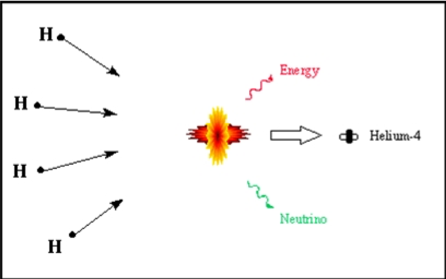{#fig-nuclear-fusion}

### Energy budget

To calculate $\Delta E = \Delta m c^2$ we need the mass of a Helium nucleus $m_\alpha$ and the mass of the proton $m_p$.

- $m_p = 1.673\times 10^{-27}\,\mathrm{kg}$
- $4 m_p = 6.690\times 10^{-27}\,\mathrm{kg}$
- $m_\alpha = 6.644\times 10^{-27}\,\mathrm{kg}$

So $\Delta m = 4m_p - m_\alpha = 0.046 \times 10^{-27}\,$kg.

And $\Delta E = \Delta m c^2 = 4.127 \times 10^{-12}\,$J. This is the energy available in one H-He fusion reaction.

So
$$
\epsilon_\mathrm{Fusion} =\frac{\Delta E}{m_p} = 2.47\times 10^{15}\,\mathrm{J\,kg^{-1}}
$${#eq-efficiency-fusion}
and the lifetime would be
$$
\tau_\mathrm{Fusion} = \frac{M_\odot \epsilon_\mathrm{Fusion}}{L_\odot} = 4\times 10^{11}\,\mathrm{years}
$${#eq-lifetime-fusion}

This is around 100 times the age of the Sun. Is this plausible?
- Yes, if we do not assume that all of the Sun's mass undergoes fusion.

# Stellar Formation

We have verified the general picture of stars as fusion-powered for most of their lifetimes. But let's back-track and look again at that energy from gravitational collapse, because we had asked the question: _Why and how do stars form?_

We know that stars have a finite lifetime, so they must have been born at some point in the past.
For the Sun this was about 4.6 billion years ago. __Gravity__ is the key player.

What did it form from? _Interstellar gas cloud._

The galaxy is full of Hydrogen and Helium produced in the big bang, and dust and gas left over from previous generations of stars (Population II).

- If it is not completely uniform then gravity will cause clumps to collapse.

- As it collapses, the gas heats up (gravitational potential energy is converted to thermal energy).

Let's compare some densities.

| Object | Number density (particles / $m^3$) |
|--------|------------------------------------|
| Earth's atmosphere | $2.5\times 10^{25}$ |
| Laboratory vacuum | $1\times 10^{16}$ |
| 'Dense' Interstellar cloud | $1\times 10^{14}$ |
| 'Average' Interstellar Cloud | $1\times 10^{13}$ |

The density in interstellar clouds is very low, so we need a lot of mass ($>100 M_\odot$) to collapse under gravity.

- If the cloud is initially rotating even slightly, the rotation speed increases as material collapses inward
- Spinning material flattens into a __protoplanetary disc__

- The dense central part forms a protostar
- Surrounding material continues to accrete onto the protostar
- The temperature rises, and the gas becomes ionised
- Eventually, if enough material is accreted, the temperature becomes high enough to initiate nuclear fusion - a star is born!
- Radiation from the hot star pushes material out until equilibrium is reached.

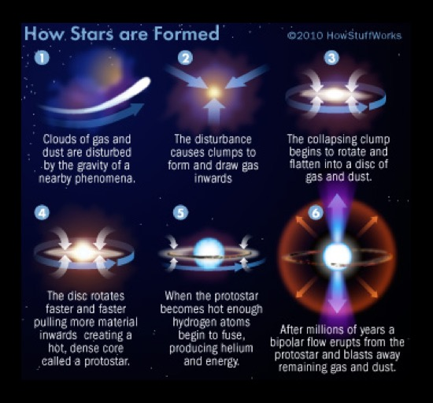{#fig-stars-formation}

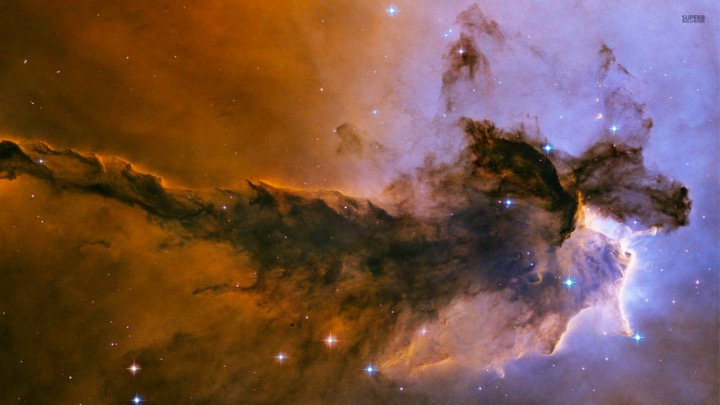{#fig-eagle-nebula}

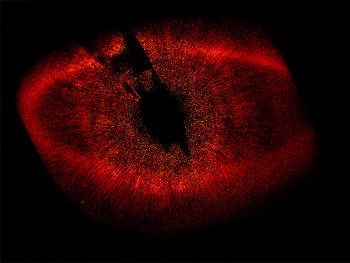{#fig-protoplanetary-disk}

## Protostars

Let's model this cloud collapse in a bit more detail.

From the previous simulation we see that initial non-uniformities are amplified by gravity. The cloud fragments as it collapses and each fragment produces a proto-star.

The temperature of the proto-star increases as gravitational potential energy is converted to heat.

- Initially, the temperature of the interstellar cloud is 10s of Kelvin.

- The interstellar medium (ISM) is made mainly of Hydrogen in the ground state, therefore it cannot produce emission lines

- Dust in the interstellar medium re-emits radiation absorbed approximately as blackbody emission in the far-infrared

$$
\lambda_{peak} = 0.0029 / T_\mathrm{eff} \approx 10^{-4}\,\mathrm{m}
$${#eq-peak-wavelength-ism}

- Radiation in the far-infrared is too long-wavelength to trigger absorption transitions and generate absorption lines (photons in the UV would be required)

- The cloud is very diffuse
- Radiation prevents the temperature from increasing very rapidly

Remember Stefan-Boltzmann Law
$$ L = 4\pi R^2 \sigma T^4$$

At first $T$ is low, but $R$ is very large (hundreds of a.u.).

- As the cloud collapses, the temperature rises slowly to begin with
- But luminosity is decreasing as $R$ gets smaller
- The temperature eventually begins to rise in the core of the cloud

### Gravitational Collapse - Energy budget

How much energy will be liberated from the gravitational field when the gas cloud collapses?

- What is the total gravitational self-energy of a sphere of mass M and radius R? (i.e. how much energy would it take to unbind the cloud?)

We can get a rough estimate by making a crude approximation:

- Two half-spheres, each mass $M/2$ come together
- Their approximate centres are a distance $R$ apart.

The gravitational potential energy of the two half-spheres is

$$
E_G = -\frac{G\left(\frac{M}{2}\right)\left(\frac{M}{2}\right)}{R} = -\frac{GM^2}{R}\times\frac{1}{4}.
$${#eq-half-sphere-gpe}

This is a rough estimate, but in the 'Stellar Structure and Evolution' course you will see that with a more precise derivation you will need to know how the density changes at different radii.

If we assume a uniform density, we get
$$
\begin{align}
E_G = -\frac{GM^2}{R}\times\frac{3}{5}.
\end{align}
$${#eq-self-gravitating-pe}

So we can remember that in a realistic situation the result will be $\approx\frac{GM^2}{R}$ times a small factor.

The energy released from the gravitational field as the cloud collapses will be $E_{lib}=E_{init} - E_{final}$. If the cloud starts out very large we can assume $E_{init}\simeq 0$, so the energy available is
$$
E_{lib}=E_G\approx \frac{GM^2}{R}.
$${#eq-collapse-grav-energy}

_What is the timescale associated to the energy liberated from the gravitational collapse (converted to heat)?_

### Kelvin-Helmholtz timescale

The timescale associated to the liberation of the energy obtained from the gravitational collapse can be derived using @eq-collapse-grav-energy and dividing this by the luminosity $L$ of the star:
$$
\tau_{KH} = \frac{E_G}{L} \approx \frac{GM^2}{R L}.
$${#eq-kelvin-helmoltz-timescale}

This is the _Kelvin-Helmoltz timescale_ (or _thermal timescale_) already encountered earlier in this chapter (@eq-gravitational-lifetime), and it is the lifetime of a star if it were powered by heat left over from its contraction.

We saw that for the Sun this is about $10^7$ years: this is roughly the time it takes a $1 M_\odot$ protostar to collapse.

- This time is quite short by astronomical standards, and this is the reason we do not see many protostars.

For a $1M_\odot$ protostar, after about 10000 years, it will have

- $T=2000-3000 K$
- $R\approx 20R_\odot$
- $L\approx 100 L_\odot$.

For a $0.08 M_\odot$ star, the pressure and temperature are never high enough to trigger nuclear fusion.

- It will still shine for its Kelvin-Helmholtz timescale though - a brown dwarf
- Planets also have residual heat left over from their formation. Jupiter gives off twice as much heat as it receives from the Sun!

## Pre-main-sequence stars

### Hayashi Tracks

Before reaching the main sequence, protostars will follow 'tracks' in the HR diagram based on changes of their properties such as temperature and luminosity.

- T-Tauri variable stars (see Chapter 3) are examples of unstable protostars evolving toward stability.
- After ending its contraction, a protostar becomes a T-Tauri and it is very luminous
- This evolutionary path for the protostar moves it around on the HR diagram
- For low-mass stars ($<3M_\odot$) this is mostly vertical motion downward until the proto-star hits the main sequence
- This almost vertical motion is __the Hayashi track__: the star's temperature does not change much but the luminosity drops quickly (e.g. lines 1 and 2 in @fig-pre-main-sequence-hr)
- During this phase the protostar is unstable - remember T-Tauri variables!

### Henyey Tracks

For stars with mass $<3M_\odot$, after the Hayashi track (nearly vertical line in the HR diagram, and drop of luminosity), there is an increase in luminosity (e.g. line 3 in @fig-pre-main-sequence-hr).
This is due to the temperature starting to rise in the star, which increases the luminosity (remember the Stefan-Boltzmann equation).

Higher mass stars have another phase:

- As the star continues to heat up, the gas in the cloud becomes fully ionised.
- No un-ionised atoms to provide atomic absorption lines - the gas becomes transparent in its diffuse outer regions
- The protostar slowly contracts until the onset of nuclear reactions in the core
- This slow contraction with an increase in temperature produces a nearly horizontal track on the HR diagram - slight luminosity increase with large temperature increase.

The horizontal lines in the HR diagram for more massive stars, as well as the lines where the luminosity increases for low-mass stars, are the __Henyey tracks__ (e.g. lines 3,5,9 in @fig-pre-main-sequence-hr).

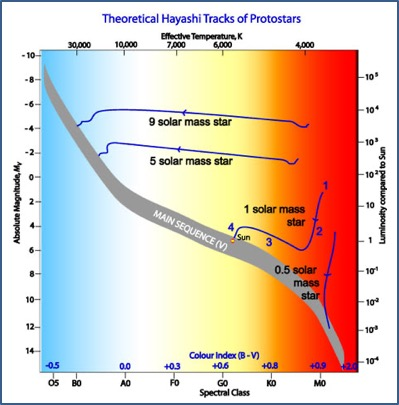{#fig-pre-main-sequence-hr}

All the pre-main-sequence stars have distinctive characteristics :

- unstable luminosity
- eject lots of gas
- surrounded by warm clouds (from which they formed)
- T Tauri stars are a good example of pre-MS stars.

Young stars also exhibit ‘bipolar outflows’:

- these are jets of material in opposite directions extending over a distance scale of about 1 lightyear
- the jets indicate that the new star is gaining material from a surrounding accretion disk

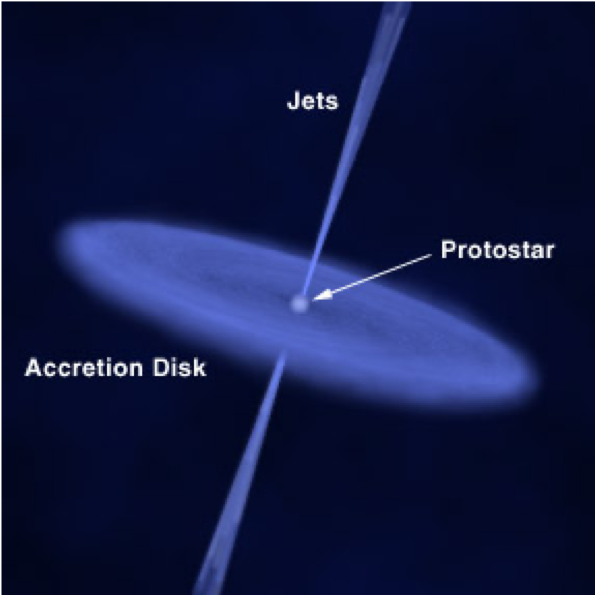{#fig-bipolar-outflow-protostar}

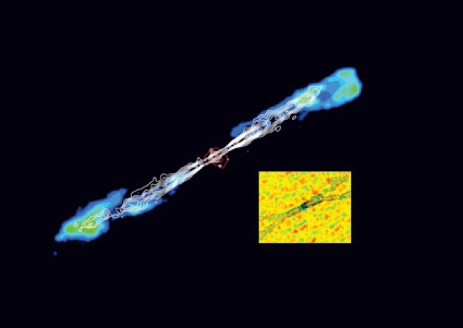{#fig-hh211}

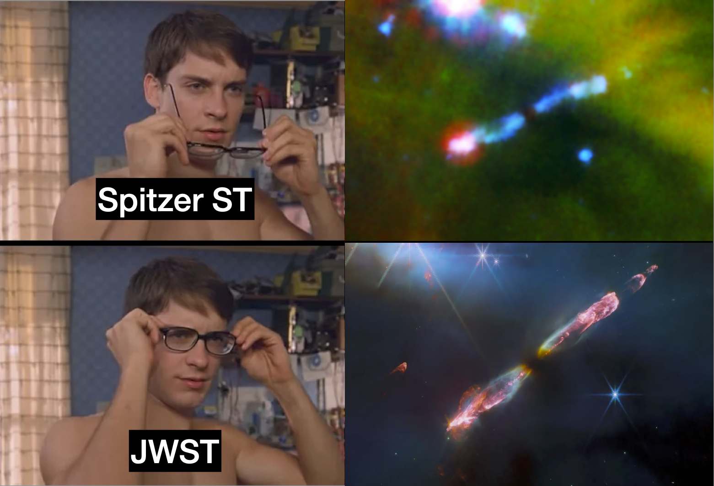{#fig-hh211-meme}

## Emission Nebulae

- Young stars are also often surrounded by emission nebulae
- these are known as HII regions
- The UV light from a hot star ( ~ 20000 K) sweeps out a cavity and ionises the surrounding hydrogen
- Recombination produces Hɑ and other emissions as well 
- overall a red glow

- The Orion, Eagle, Trifid and Lagoon nebulae are all (beautiful) examples of emission nebulae

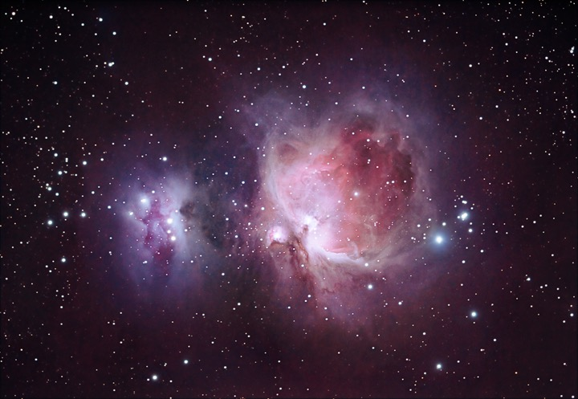

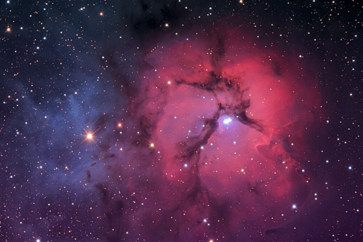

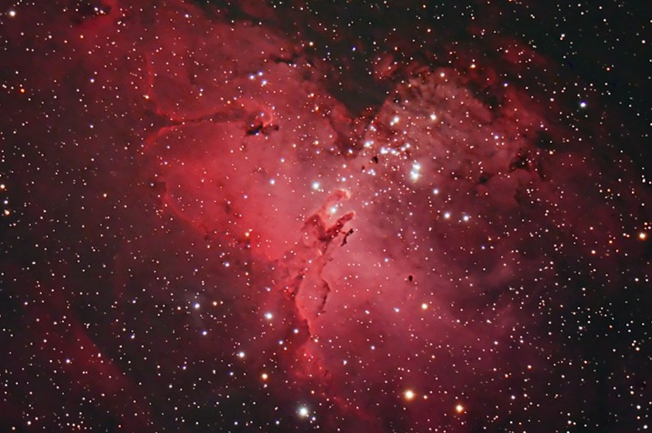

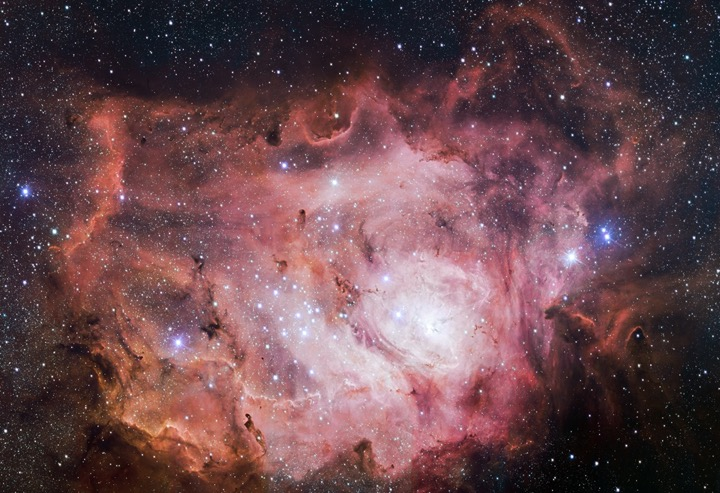

## Cloud Collapse

### What conditions result in cloud collapse?

The __Virial Theorem__ states that the total kinetic energy of a stable, self-gravitating mass distribution, is negative one half of the total gravitational potential energy
$$K.E = -\frac{1}{2} P.E.$$

This helps us calculate the conditions that must exist for cloud collapse

- The number of particles with mass $m_p$ in the cloud (total mass $M_c$) is $N = M_c/m_p$
- The potential energy of a spherical cloud with uniform density is
$$E_G = -\frac{3}{5}\frac{GM_c^2}{R_c}$$

- The cloud is a _gas_

The kinetic energy of each particle in the gas is the thermal energy $\frac{3}{2}k_B T$

So the total K.E. is $$E_K = \frac{3M_c}{2m_p}k_B T $$

So the Virial Theorem tells us

$$
\frac{3M_c}{2m_p}k_BT = -\frac{1}{2}\times \left(-\frac{3}{5}\frac{GM_c^2}{R_c}\right)
$$

The cloud will collapse if the virial theorem is unbalanced, i.e.
\begin{align}
\frac{3M_c}{2m_p}k_BT &< -\frac{1}{2}\times \left(-\frac{3}{5}\frac{GM_c^2}{R_c}\right) \\
\frac{k_BT}{m_p} &< \frac{1}{5} \frac{GM_c}{R_c}
\end{align}

So for a cloud of radius $R_c$ at temperature $T$, collapse will happen if
$$
M_C > \frac{5k_BTR_c}{m_p G}
$$

If the cloud has initial density $$\rho_0 = \frac{M_c}{(4/3)\pi R_c^3}$$
then
$$
R_C = \left(\frac{3M_C}{4\pi\rho_0}\right)^{1/3}
$$
Substituting into previous expression for collapse we find
$$
M_C > \frac{5k_BT}{m_p G}\left(\frac{3M_C}{4\pi\rho_0}\right)^{1/3}
$$

### Jeans mass
So, simplifying we find the necessary mass for a cloud to collapse is
$$
M_C > \left(\frac{5k_B T}{m_P G}\right)^{3/2}\left(\frac{3}{4\pi\rho_0}\right)^{1/2}
$$
This critical mass is called the __Jeans Mass__, $M_J$.
- A cloud with $M_C>M_J$ will collapse under gravity

For a dense interstellar gas cloud we have $\rho_0 = m_p \times 10^{14} = 1.67\times10^{-13}\,\mathrm{kg\,m^{-3}}$. If we assume an initial temperature $T\approx 10 K$.

Then $M_J \approx 6\times 10^{29}\,\mathrm{kg} \approx \frac{1}{2}M_\odot$.
- So we can roughly predict the mass of a star!
- Real collapsing clouds fragment and have a range of temperatures and shapes so this is very rough

Initially the collapse is essentially free-fall.
- The cloud can radiate away the liberated energy as the density is low
- Temperature remains fairly constant until the late stages

### Cloud collapse - temperature

Using the Virial theorem we can also predict the temperature of the cloud once it reaches equilibrium
- Denote the final state with subscript $*$
\begin{align}
\frac{3}{2}k_BT_*\frac{M_*}{m_p} &= \frac{1}{2}\times\frac{3}{5}\times \frac{GM_*^2}{R_*} \\
T_* &= \frac{GM_*m_p}{5k_BR_*}
\end{align}

For a $1 M_\odot$ star with radius $1 R_\odot$, and $m_p=1.66\times 10^{-27}\,\mathrm{kg}$ we find
$$
T_*\approx 4\times 10^6\,\mathrm{K}
$$
- Given the rather crude approximations this isn't a bad estimate for the core temperature of the star

So, for a large enough $M_*/R_*$ ratio the temperature becomes high enough to fuse Hydrogen into Helium.
- The temperature released by fusion provides the energy needed to stabilise the cloud against further contraction

## The proto-star becomes a star

# Main sequence Stars

### Nuclear fusion

We have seen that fusing 4 Hydrogen nuclei into a Helium nucleus is a plausible mechanism for producing stellar energy.
- We had assumed that all the star's mass is available for fusion
- Collision of 4 H nuclei is incredibly unlikely.
- Fusion is much more likely in a series of steps involving two-particle fusion
- This is called the p-p chain reaction

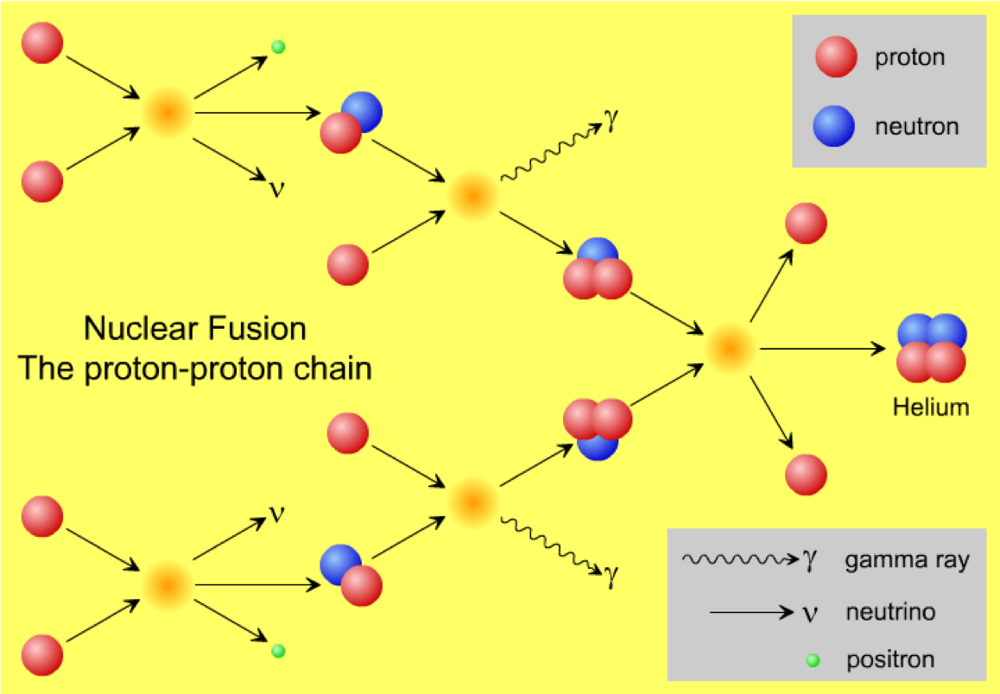

## The p-p chain reaction

1. Two mass-1 isotopes of Hydrogen (protons) undergo a simultaneous fusion and beta decay, producing a positron, a neutrino and a mass-2 isotope of Hydrogen (deuterium)
$$^1H +\ ^1H \rightarrow \beta^+ + \nu +\ ^2H$$

2. The deuterium reacts with another $^1H$ to form Helium-3 and  a gamma ray
$$^1H+\ ^2H \rightarrow\ ^3He + \gamma$$

3. Two helium-3 isotopes produced in separate implementations of the first two stages fuse to form helium-4 plus two mass-1 hydrogen isotopes (protons)
$$^3He + \ ^3He \rightarrow\ ^4He+2\ ^1H$$

So the net reaction is
$$ 4\ ^1H \rightarrow \ ^4He + 2\beta^+ + 2\nu + 2\gamma$$

A small amount of energy is carried off by neutrinos

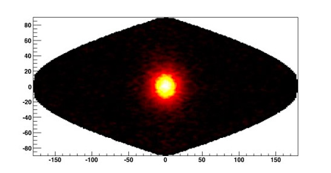
_A "neutrinograph" of the Sun_

### p-p reaction in stars

- In stars $\sim 1 M_\odot$, about 85% of nuclear reaction occur via the p-p chain.
    - The other reactions are the temporary creation of heavier elements: $^7Be$, $^7Li$

- In more massive stars the core temperature is higher $>1.7 \times 10^7\,\mathrm{K}$ and other reactions are possible
    - The dominant one is the CNO cycle

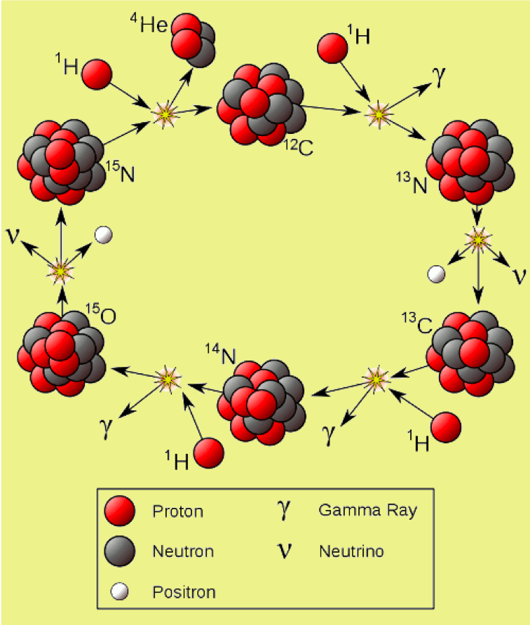

- Net reaction is $4 ^1H \rightarrow ^4He + 3\gamma + 2\beta^+ + 2\nu$
- Carbon is needed for this reaction to take place
- It acts as a catalyst but is not used up
- You don't need to memorise this reaction!

### Energy Creation Rates : pp-chain or CNO-cycle?
- The energy creation rates for the 2 chains depend strongly on temperature
- However, for the CNO-cycle to work at all, carbon, nitrogen and oxygen must be present
    - this will depend on the star type
- At lower masses and, therefore, temperatures, the pp-chain dominates
- At higher temperatures, there is a sudden transition to dominance by the CNO-cycle

The energy production rate varies strongly with temperature for the CNO-cycle and so is more important for heavier stars – which have higher interior temperatures.

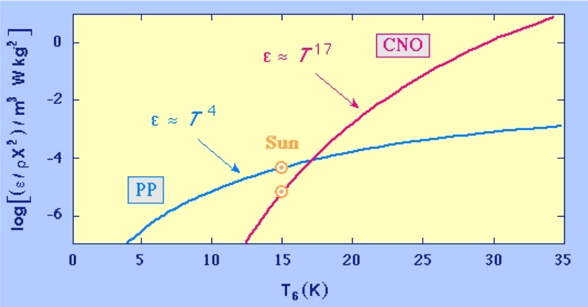

# Stellar Structure

# Modelling stars as gases

So far we have been talking about stars as being made up of gases.
- The mean density of a star is around 1.4 times that of water
- The central density in the core is about 150 times that of water

Are we justified in using this model?

At high temperatures, Hydrogen is ionised into protons and electrons
- These are _tiny_ compared to Hydrogen atoms

Let's compare the density of Hydrogen atoms to protons.

| Quantity | Hydrogen | Protons |
|----------|---------|----------|
| Radius | $\sim 10^{-10}\,\mathrm{m}$ | $\sim 10^{-15}\,\mathrm{m}$ |
| Volume | $\sim 10^{-30}\,\mathrm{m}^3$ | $\sim 10^{-45}\,\mathrm{m}^3$ |
| Equivalent number density | $\sim 10^{30}\,\mathrm{m}^{-3}$ | $\sim 10^{45}\,\mathrm{m}^{-3}$ |
| Equivalent mass density | $\sim 1.7\times 10^{3}\,\mathrm{kg\,m^{-3}}$ | $\sim 1.7\times 10^{18}\,\mathrm{kg\,m^{-3}}$ |

- In the photosphere, the density of hydrogen is only 0.0001 kg/m$^3$
- The hydrogen is mostly un-ionised (see part 4 - stellar atmospheres)
- Since the density of neutral hydrogen is much lower than the density of maximally packed hydrogen atoms it behaves quite like an ideal gas.

- In the interior, the temperature is so high that hydrogen is fully ionised
- Density at the core is $\approx 150000\,\mathrm{kg\,m^{-3}}$, $\ll 10^{18}\,\mathrm{kg\,m^{-3}}$ maximal density for protons
- We can think of it as a gas made up of a mixture of protons and electrons

# Stellar structure - equilibrium

Inside a stable star, the inward pull of gravity is balanced by the thermal pressure due to the heat.

We can use this fact to develop a model of the stellar interior based on __hydrostatic equilibrium__.

This can help us work out what the central temperature and pressure is for a star.

# Hydrostatic Equilibrium

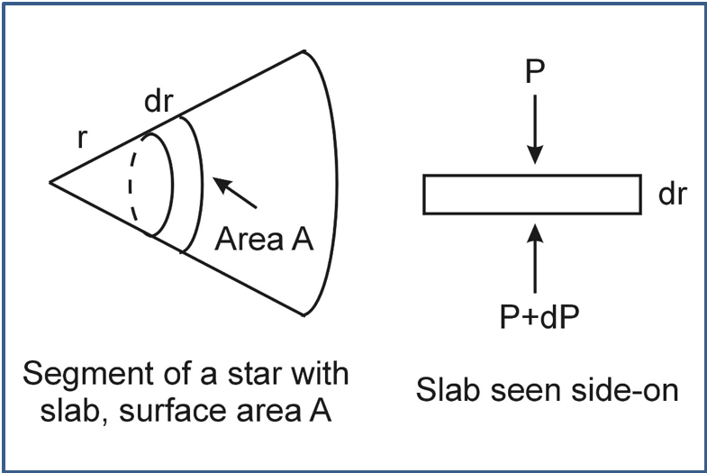

- Consdier a small slab of the star, surface area $A$, thickness $dr$ at a distance $r$ from the centre
- $M(r)$ is the mass _inside_ radius $r$
- $\rho(r)$ is the density at radius $r$
- The Mass of the slab is then $dm = A dr \rho$

In equilibrium the forces on each side of the slab are balanced.

\begin{align}
F_{grav} &= -\frac{GM(r)dm}{r^2}\\
&=-\frac{GM(r)\rho(r)A dr}{r^2}
\end{align}

This is balanced by the extra pressure from the gas below, which is $F_{pressure}=AdP$.

The slab does not move, so the two are balanced:
\begin{align}
F_{pressure}&=F_{grav}\\
AdP&=-\frac{GM(r)\rho(r)Adr}{r^2} \\
\frac{dP}{dr}&=-\frac{GM(r)\rho(r)}{r^2}
\end{align}

This is the equation of hydrostatic equilibrium.
We can solve this differential equation to find the pressure a function of radius, $P(r)$.
- But we need to know $M(r)$ and $\rho(r)$ to solve the equation.
- Note the negative sign: the pressure decreases torward the outside of the star (as expected)

- For simplicity we can assume the star has uniform density: $\rho_{av}$.
- Then the mass inside a radius $r$ is $M(r)=\frac{4}{3}\pi r^3\rho_{av}$.

Inserting this into the equation of hydrostatic equilibrium gives us:
$$
\frac{dP}{dr} = -\frac{GM(r)\rho(r)}{r^2} = -\frac{4}{3}\pi G\rho_{av}^2 r
$$

#### Solving the equation of hydrostatic equilibrium
Starting with

$$\frac{dP}{dr} = -\frac{GM(r)\rho(r)}{r^2} = -\frac{4}{3}\pi G\rho_{av}^2 r
$$

We need to use boundary conditions to solve the equation:
- At the surface of the star the pressure drops to 0, so $P(R)=0$, where $R$ is the radius of the star.
- At the centre, $r=0$, let the pressure be $P_0$

Solve the equation by integrating both sides
\begin{align}
\int_{P_0}^0 dP &= -\frac{4}{3}\pi G\rho_{av}^2 \int_0^R r dr \\
\left[P\right]^0_{P_0} &= -\frac{4}{3}\pi G\rho_{av}^2\left[\frac{r^2}{2}\right]_0^R \\
0 - P_0 &= -\frac{4}{6}\pi G\rho_{av}^2 \left[R^2-0\right] \\
P_0 &= \frac{2}{3}\pi G\rho_{av}^2 R^2
\end{align}

### Central pressure of the Sun

Our result
$$P_0 = \frac{2}{3}\pi G\rho_{av}^2 R^2$$
can be applied to find the central pressure in the Sun.

- $\rho_{av}=\frac{M_\odot}{\frac{4}{3}\pi R^3}=1409\,\mathrm{kg\,m}^{-3}$

Using $R_\odot=6.957\times10^{8}\,\mathrm{m}$, we find

$$P_0 = 1.3\times 10^{14}\,\mathrm{N\,m}^{-2}$$

- About a billion times the air pressure in the room!

## More accurate estimate

A better model would allow the density to increase toward the centre.
- They predict:
    - $P_0 \approx 10^{16}\,\mathrm{N\,m}^{-2}$
    - $\rho_0 \approx 10^5\,\mathrm{kg\,m}^{-3}$
- This density is about 10 times the density of lead

## Central temperature in the Sun

We can use the ideal gas law: $PV=nRT$
- $P$: Pressure
- $V$: Volume
- $n$: number of moles of the gas
- $R=N_A k_B$ is the ideal gas constant
- $N_A=6.02\times 10^{23}\,\mathrm{mol}^{-1}$ is Avogadro's constant

Re-write this as
$$P=\frac{nN_Ak_BT}{V} = \frac{M}{V}\frac{k_BT}{\mu}$$
- Where $\mu$ is the mean molecular weight of the atoms
    - Since we are talking about Hydrogen, $\mu=m_p$ the proton mass
- $\rho = \frac{M}{V} = \frac{\mu n N_A}{V}$ is the density

This gives us
$$
P=\frac{M}{V}\frac{k_BT}{\mu} = \rho_{av}\frac{k_B T}{\mu}
$$

Rearrange to find the central temperature
$$
T_0 = \frac{\mu P_0}{k_B\rho_{av}} \approx 10^7\,\mathrm{K}
$$
While we assumed constant density here, it turns out that more sophisticated models give approximately the same answer.

## Stellar structure - more realistic models

More realistic models allow for temperature, pressure and density gradients inside the star.
- When the temperature gradient is too high, pressure at the bottom of a slab is greater than required to balance gravity
- the slab will experience a net outward force
- convection can occur instead of simple energy transport by radiation.

# Interior of Star $<1.5 M_\odot$

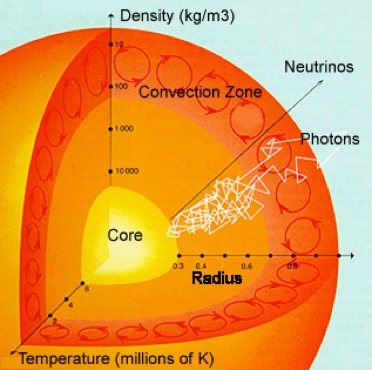

- In stars like the Sun, photons scatter off nuclei or electrons other every millimetre or so
- It takes them about 50,000 years to escape the Sun
- Hydrogen is converted to helium in the core;
- very little helium escapes
- Both radiation and convection transport heat energy from the core to the surface

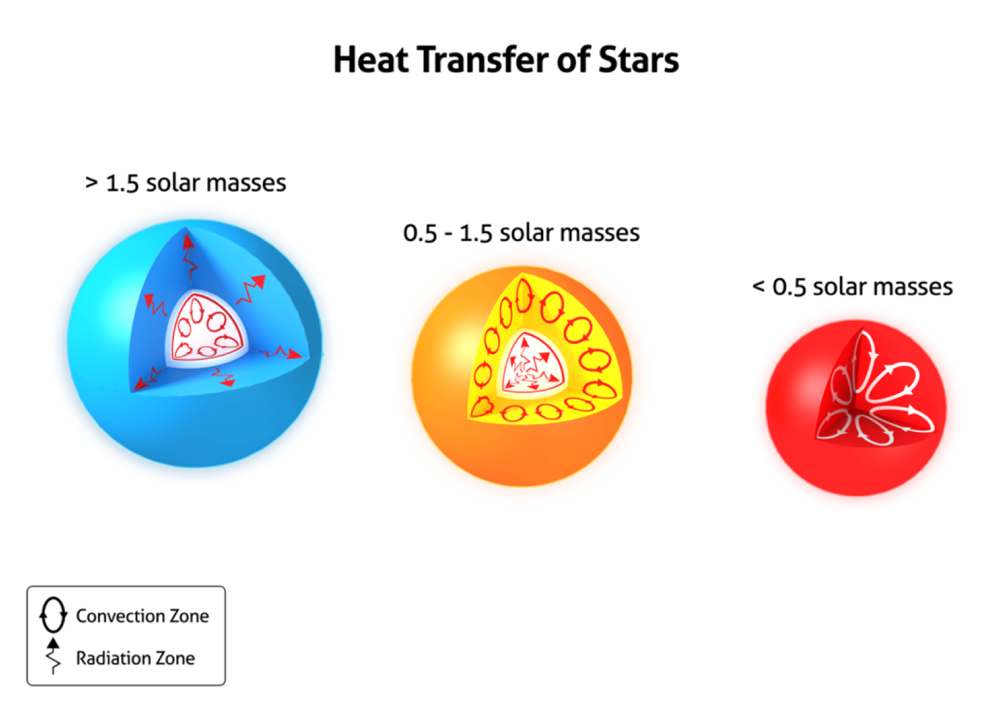

