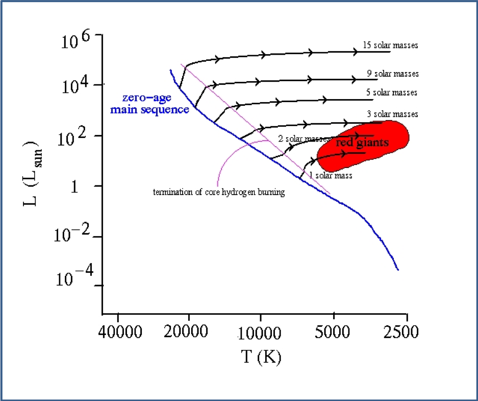
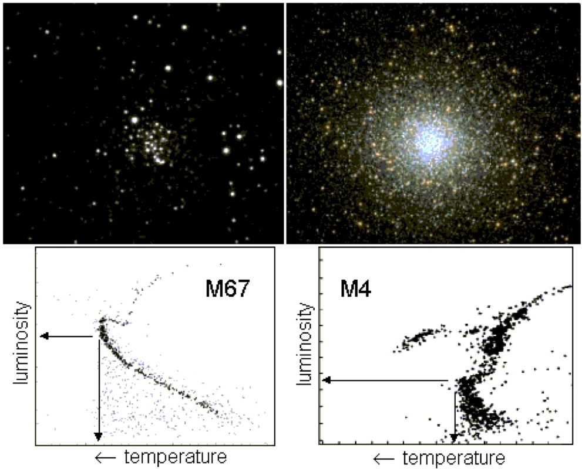
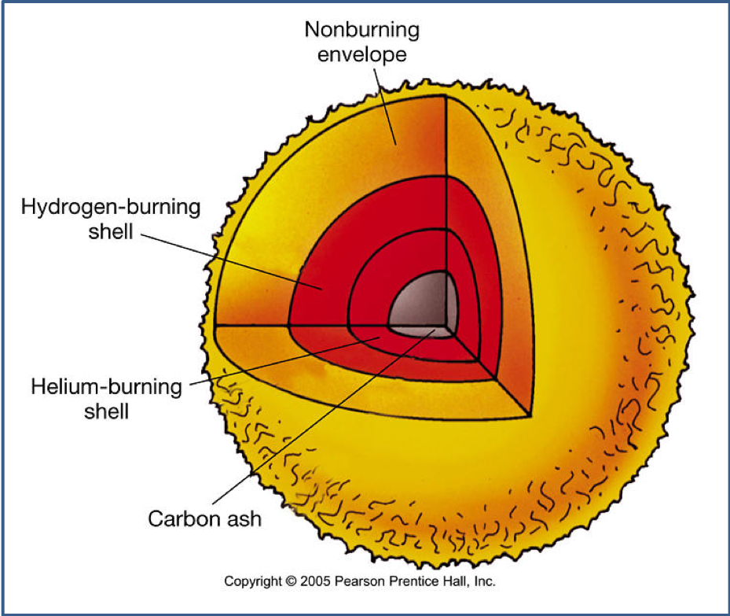
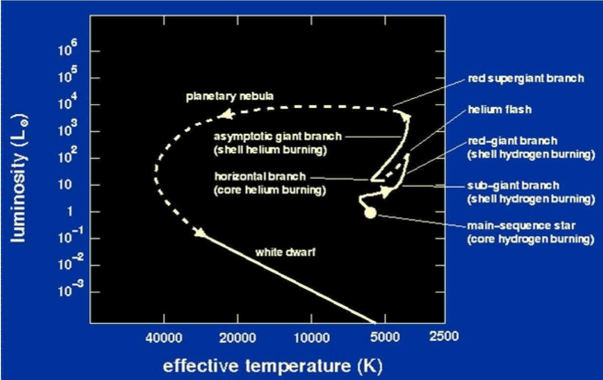
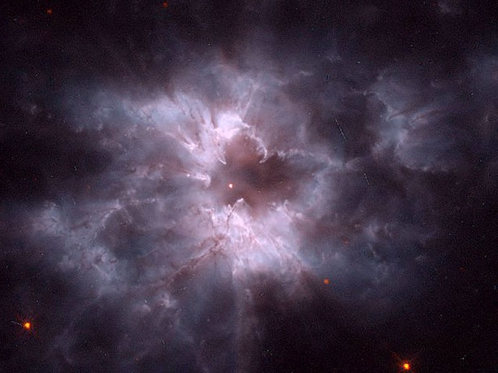
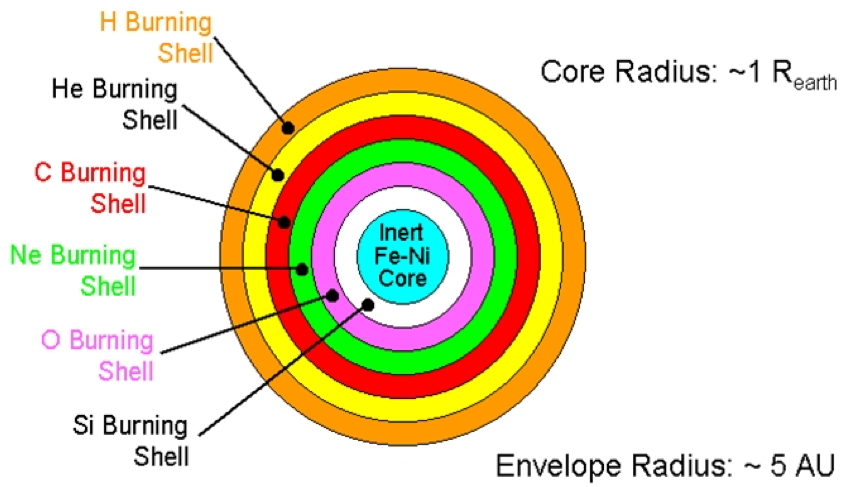
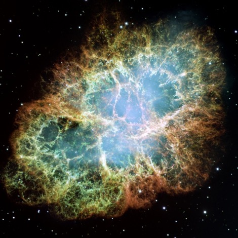

-----------

# Mass-luminosity relationship revisited

Recall the earlier approximate relationship that seems to apply to main sequence stars:
$$
L\propto M^{3.5}
$$

- Why the exponent 3.5?
- Let's see if we can approximate this with our new understanding

- First, show that the core temperature is proportional to M/R.

\begin{align}
T_0 &\propto \frac{P_0}{\rho_{av}} \\
&\propto \frac{\rho_{av}^2 R^2}{\rho_{av}} \\
&\propto \rho_{av} R^2 \\
&\propto \frac{M}{R}
\end{align}

Let's assume that surface temperature is propotional to core temperature
- Actually it depends slightly on $R$

Use Stefan's Law:
\begin{align}
L&=4\pi R^2 \sigma T^4 \\
L&\propto \frac{R^2M^4}{R^4} \\
&\propto \frac{M^4}{R^2}
\end{align}

However, $M\propto R^3$, so $R^2\propto M^{2/3}$.

- Substitute into the previous expression to get:
\begin{align}
L &\propto \frac{M^4}{R^2} \\
L&\propto \frac{M^4}{M^{2/3}}\\
L&\propto M^{3.3}
\end{align}

- So using our crude approximations we can find an exponent nearly equal to 3.5.

## Mass luminosity relationship - implications

- The most massive stars are the most luminous
- The amount of fuel available is proportional to the star's mass, so we can work out the main-sequence lifetime
$$
\tau \propto \frac{M}{L} \propto M^{-2.5}
$$

- So more massive stars evolve faster and spend less time on the main sequence

# Main sequence turnoff

# Main sequence lifetime

- Let's assume that stars leave the main sequence when they convert 20% of their hydrogen fuel into helium
- If this releases $\Delta E$ Joules of energy per kilogram of hydrogen, then Luminosity = total energy released / main sequence lifetime:

$$
L=\frac{0.2 M \Delta E}{\tau_{MS}}
$$

- We can use the mass-luminosity relationship to find $L$
- Then we can find the time on the Main Sequence, $\tau_{MS}$.
- We can use the Sun as a reference point to get around the unknown constants

\begin{align}
\tau_{MS}&=\frac{0.2 M \Delta E}{L}\\
\tau_{MS\odot}&=\frac{0.2 M_\odot \Delta E}{L_\odot}\\
\end{align}
Divide the top by the bottom:
$$
\frac{\tau_{MS}}{\tau_{MS\odot}}= \frac{M}{M_\odot}\frac{L_\odot}{L} = \left(\frac{M_\odot}{M}\right)^{2.5}
$$

We know enough about the Sun to work out its main sequence lifetime:
\begin{align}
\tau_{MS\odot}&=\frac{0.2 M_\odot \Delta E_{H-He}}{L_\odot}\\
&= 2\times 10^{10}\mathrm{years}
\end{align}

- The previous result shows that a star 4 times as massive as the Sun has a main sequence lifetime that is $4^{2.5}=32$ times shorter

So for a star on the main sequence,
$\tau_{MS}= 2\times 10^{10} \left(\frac{M_\odot}{M}\right)^{2.5}$

# Age of star clusters

- The stars in any given cluster were all formed at about the same time but with a wide range of masses

- The stars in any given cluster are all about the same distance away, so when we see differences in apparent brightness it is because of differences in intrinsic brightness

- We can plot the stars in a cluster on an HR diagram
- To find the age of a cluster, we look for the highest mass star still on the Main Sequence – a star near the top-left hand side of the HR-diagram
- This star will allow us to determine the age of the cluster
- The ages of clusters are important for determinations of the age of the Universe

## Young versus old clusters

- M67 is a young (open) cluster
    - for a young cluster you see more of the Main Sequence
- M4 is an old (globular) cluster
    - the Main Sequence lifetime is significantly shorter for the older cluster
    - The location of the turnoff differs precisely because of the relationship derived earlier :

$$\tau_{MS} = 2\times 10^{10} \left(\frac{M_\odot}{M}\right)^{2.5}
$$

## Evolution of low-mass stars ($\sim 1 M_\odot$)

- Eventually H-He reactions runs out of fuel in the core
- The radiation pressure then drops and gravity begins to triumph - the core collapses
- The temperature of the core increases to $10^8$ K
- Helium starts to fuse to carbon in the core
    - this is the Triple Alpha process

### Triple-alpha process

\begin{align}
^4He +\ ^4He \rightarrow ^8Be+\mathrm{energy} \\
^4He +\ ^8Be \rightarrow ^{12}C+\mathrm{energy} \\
^4He +\ ^{12}C \rightarrow ^{16}C+\mathrm{energy}
\end{align}

- Three alpha particles ($^4He$) are used to make $^{16}C$

### Helium Fusion in a low-mass star

- Helium fusion is a highly exothermic process
- the temperature of the core climbs further
- Un-burned hydrogen around the core starts to fuse
- the remaining hydrogen is fused to helium again

- All this extra energy causes the luminosity to increase

## Red Giants and Supergiants

The increased luminosity provides extra radiation pressure
- the outer envelope of gas inflates and cools
- for a star of $\sim 1M_\odot$, this equates to a radius of $\sim 100R_\odot$

A high luminosity star with cool outer regions is called a __Red Giant__

When the helium core burning stops there is a further collapse and rise in temperature
- The shell of helium around the core starts to burn

- The star becomes a Red Supergiant

## Inside an evolved low-mass star

## Instability and evolution to White Dwarf

The star is now unstable!
- it pulses slowly and its luminosity increases by a factor of about 10 over a period of about 5000 years

The outer layers separate and are blown off
- a planetary nebula is formed and the hot core is exposed
- this process accounts for about half the star’s mass
- When all the helium fuel is used up, the star is supported by degeneracy pressure

It slowly cools to become a White Dwarf

### Evolutionary track of a low mass star

## NGC2440 planetary nebula

## Evolution of High Mass Stars ($\ge 8M_\odot$)

Evolution is similar to that of low mass stars but there is added gravitational pressure due to the higher mass
- higher temperatures are possible
- more (different) nuclear reactions are possible

After helium is used up, the core collapses until degeneracy sets in to stop the star shrinking
- temperature goes up and helium-carbon fusion starts

- This cycle repeats through heavier and heavier elements up to iron
- The star consists of concentric shells – the onion model of the interior

### Iron Catastrophe

- Fusion reactions are exothermic (release energy) only if the reactants are lighter than iron
- Fission reactions (the other kind of nuclear reaction) are exothermic only if the reactants are heavier than iron
- So after a certain point ( i.e. when iron has been produced) fusion stops producing energy and no other energy-producing nuclear process can take place

# Supernova

- At this point the core has no more nuclear fuel left to sustain the high temperature and pressure
- But the core is too massive to be supported by degeneracy pressure, so
    - the core collapses – in  ~ 0.25 seconds !
    - resulting in the formation of a neutron star or a black hole
    - the outer layers of the star are blown off – the supernova remnant

| Event | Temperature (K) | Time |
|-------|-----------------|------|
| Hydrogen Burning | $4\times 10^7$ | $7\times 10^6$ years |
| Helium Burning | $2\times 10^{8}$ | $7\times 10^5$ years |
| Carbon Burning | $6\times 10^8$ | 600 years |
| Neon Burning | $1.2\times 10^9$ | 1 year |
| Oxygen Burning | $1.5\times 10^9$ | 6 months |
| Silicon Burning | $2.7 \times 10^9$ | 1 day |
| Core Collapse | $5.4\times 10^9$ | 0.25 seconds |
| Supernova! | - | - |

## The Crab Nebula

The Crab Nebula is the remnant of a supernova that occurred in 1054.

