-----------

In this second part of this course we will be looking at post-main-sequence evolution.
This means we will be looking at the end states of stellar evolution: white dwarfs, neutron stars, and black holes.
Unlike main sequence stars we have been looking at so far, these objects are _not_ powered by nuclear fusion. We will require some new physics to understand their behaviour and explain the observations.

## Recap

We already know that star form from collapse of gas clouds. Why doesn't the collapse continue down to a point?

- Protostars release gravitational potential energy as heat
- Main sequence stars and 'burning' stars, have nuclear reactions to release heat
- This heat creates pressure in the interior that stops further collapse (hydrostatic equilibrium)

$$P = nRT/V $$

We need a finite temperature $T$ to create pressure.
Since a star is losing heat into space, the heat energy must be continually replenished.

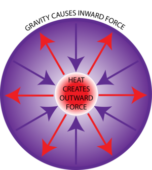

- In protostars, contraction continues until fusion takes over
- In burning stars, fusion of successively heavier elements takes place
- But there is a limited amount of fuel in a star (see Iron Catastrophe)

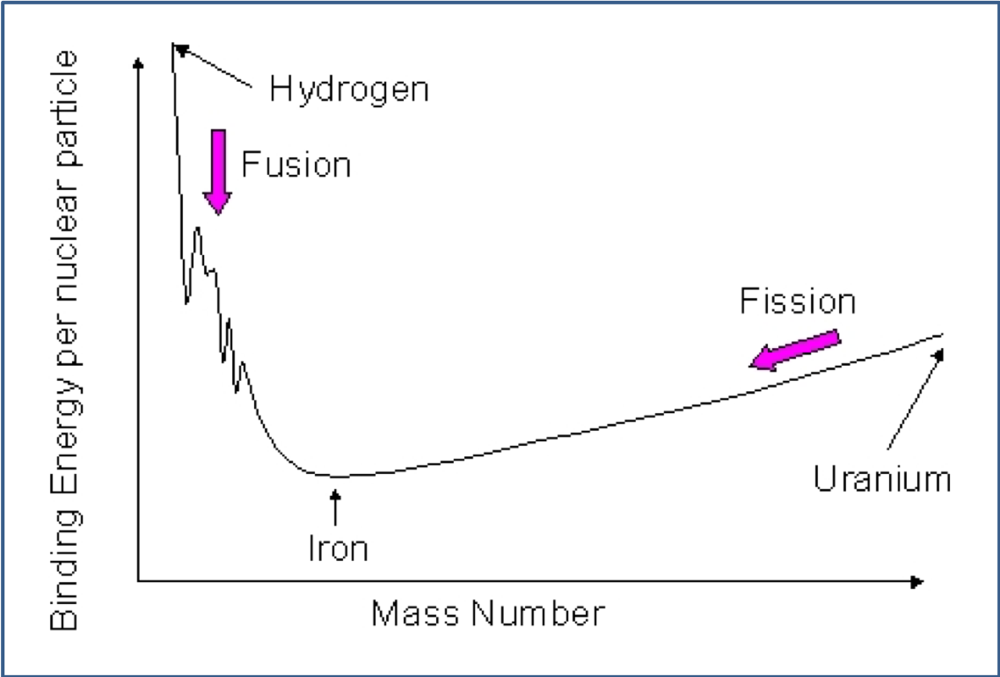{#fig-iron-catastrophe}

When the fuel runs out, the star will resume _contracting_, since there is no longer a thermal pressure to balance gravity.

- So what is it that keeps White Dwarfs, Neutron Stars etc from collapsing?
- And why is it that some stars _do_ collapse to black holes?

## Low-mass stars ($\sim 1 M_\odot$)

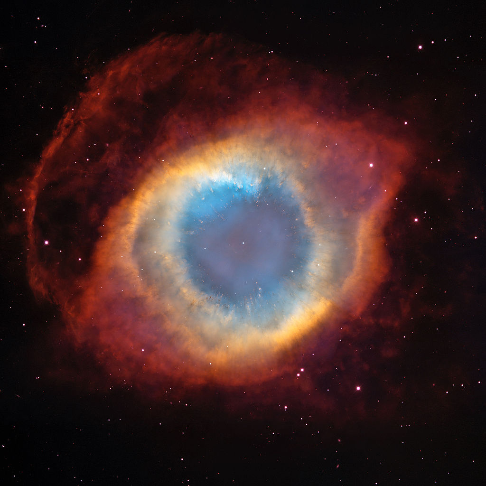{#fig-helix-nebula}

Stars fuse elements up to carbon. Thereafter, because stellar mass is low, core pressure due to self-gravity is not enough to cause sufficient temperature rise to begin fusion of heavier elements.

Carbon core collapses to form a white dwarf (see later), outer layers are expelled to form a planetary nebula.

## High-mass stars ($\gtrsim 8M_\odot$)

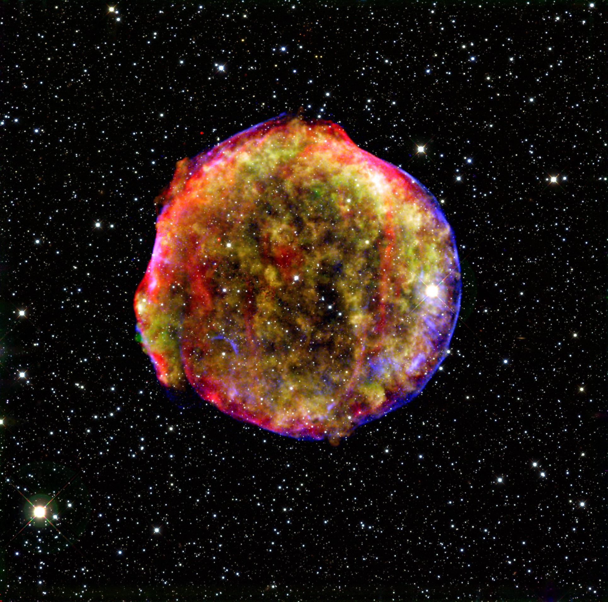

_The Tycho supernova remnant (Seen in 1572, the 3rd/4th
recorded in our galaxy).  A type Ia event. (185, 1006, 1054, 1572, 1604,
1987*)_

 Stars continue fusion up to nickel and iron. Iron is
 the most tightly bound atomic nucleus -- no more energy available
 from fusion.
 
 Star also collapses, but since it is much more
 massive than a white-dwarf-progenitor, more gravitational energy
 can be released: much more violent event - a __supernova__.

## Fates of stars

| ZAMS mass | Collapsing mass | Fate |
|-----------|-----------------|------|
| $\lesssim 8\,M_\odot$ | $1.4\,M_\odot$ | white dwarf |
| $8 - 25 M_\odot$ | 1.4 - 3 $M_\odot$ | Neutron Star |
| $\gtrsim 25 M_\odot$ | $\gtrsim 3 M_\odot$ | Black Hole |

In very late stages of stellar evolution, much of the
  star's initial mass (_Zero Age Main Sequence Mass_) is blown off as
  the outer layers are shed into space (_radiation pressure_). The mass of the collapsing
  core is therefore much less than the _ZAMS_ mass.

## Supernova classification

Supernovae are classified into different types depending on whether they show hydrogen in their spectrum. Type I have almost no hydrogen, Type II do show presence of hydrogen.

- Type Ia are believed to be the result of accreting white dwarfs being pushed over the mass limit and undergoing further nuclear fusion in a runaway reaction that destroys the star.
- Types Ib, Ic and II result from the collapse of high-mass stars straight to a neutron star or black hole.

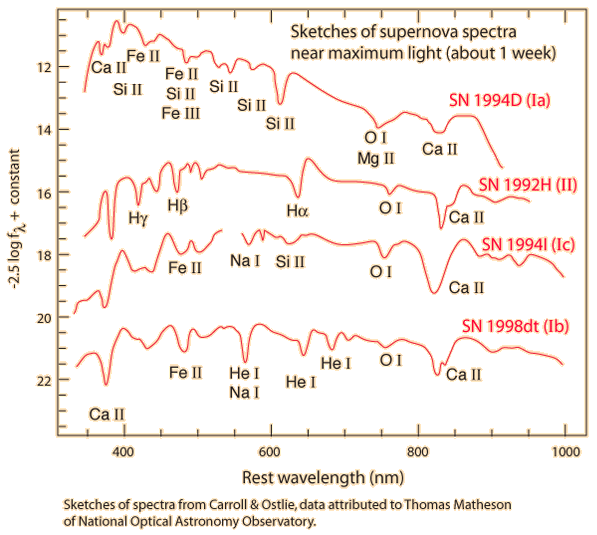
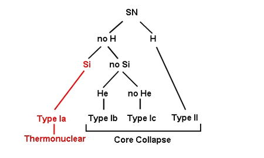

The lack of hydrogren indicates that the the stars involved have been stripped of their hydrogen envelopes.

- Types Ia,b,c indicate that different mechanisms are at work.
- Type Ia are found in all types of galaxies.
- Types Ib,c are only found in spiral galaxies where there was recent star formation.
- This implies that Types Ib,c and due to massive short-lived stars.

## Supernova mechanism

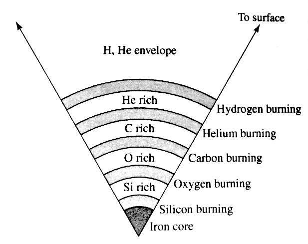

Need $> 8M_\odot$ for core collapse to allow carbon and oxygen burning.
- An onion-like shell structure develops with fusion by-products (ashes)
sinking down through the layers.
- The final stage is silicon
burning which generates a
host of nuclei centred around
the 56Fe minimum of the 26
binding energy curve.
- Since each stage is less energy efficient, they take shorter and shorter times to complete (for a 20M⊙ star, Hydogen burning took 107 years; Silicon burning takes
∼days).

- Nuclear fuel is exhausted in the core. Radiated energy can no
    longer be replaced, so pressure falls.
    _Hydrostatic equilibrium is
    lost_, so core rapidly contracts ($\sim 1/4$ second).
    
- Contraction releases gravitational potential energy, causing
    temperature to rise to $T\sim~ 5\times 10^{9}$K. High temperature
    allows _endothermic_ (heat absorbing) reactions.

## Photodisintegration

  Earlier _exothermic_ fusion reactions are reversed:
  photodisintegration.
  \begin{align}
    ^{56}_{26}\text{Fe}+\gamma&\rightarrow
    13\,^{4}_{2}\text{He}+4\,\text{n}\nonumber\\
    ^{4}_{2}\text{He}+\gamma&\rightarrow 2\text{p}^{+}+2\,\text{n}\nonumber
  \end{align}

## Neutron capture

  Endothermic reactions also create elements _heavier_ than iron by
  neutron capture,e.g.
  \begin{align}
    ^{56}_{26}\text{Fe}+128\text{n}&\rightarrow
    ^{238}_{26}\text{Fe}\nonumber\\
    ^{238}_{26}\text{Fe}&\rightarrow ^{238}_{92}\text{U}+66\text{e}^{-}+66\bar{\text{v}}_{\text{e}}\nonumber
  \end{align}
  Produces elements heavier than iron, e.g. copper, silver, gold,
  platinum, bismuth, thorium, uranium, etc.

## Electron capture

  Endothermic reactions absorb $\sim 2/3$ of gravitational energy
  released by initial collapse $\rightarrow$ further contraction
  $\rightarrow$ further temperature rise.
  
  Core temperature
  reaches $\sim 10^{10}$K. Hot enough for inverse beta decay (reverse
  of normal beta decay of radioactive nuclei).
  \begin{align}
    \text{p}^{+}+\text{e}^{-}&\rightarrow
    \text{n}+\text{v}_{\text{e}}\nonumber
  \end{align}
  
  This process is highly endothermic. Also, since neutrinos are very
  weakly interacting, they easily escape to space: 2 particles
  ($\text{p}^{+}$ and $\text{e}^{-}$) become one
  neutron. Consequence: {\bf extreme pressure drop in core}. Core separates
  from the outer envelope and goes into __free-fall__, collapsing at $\sim
  10^{5}\,\text{km}\,\text{s}^{-1}$ ($\sim 1/3 c$).

## Collapse

- Core collapses to radius of $\sim 20$ km. Consists of closely-packed
    neutrons at $\sim 3\times$ nuclear densities ($\sim 10^{9}$ tonnes
    cm$^{-3}$).
- At this point, core stiffens due to __degeneracy
    pressure__ (see later) and abruptly halts collapse. Degenerate core rebounds
    slightly, sending shock wave back up through in-falling
    material.
- Shock wave initiates further endothermic reactions and loses energy,
    but is boosted by huge flux of neutrinos emanating from core.
    Further in-falling material continues to strike degenerate core and
    rebound $\sim$ elastically.

## Remnant

 Bouncing material and enormous neutrino flux blows outer layers of star off
into space, forming a supernova remnant.

## The Crab Nebula

- ${\sim}6500$ light years away.
 
- Diameter of $\sim 11$ light years.
 
- Current expansion velocity $\sim
      1500$ km s$^{-1}$, i.e. $\sim 0.5\%$ of speed of light.
 
- This is the 2nd recorded observed supernova. Seen on July 4th 1054 by
a court astrologer during China's Sung dynasty.
 
- Initially visible during the day!

## Why do SN remnants expand so quickly?

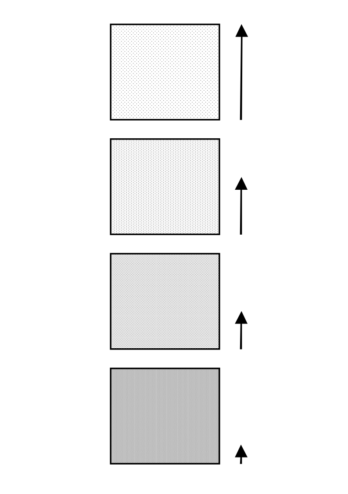

 As the shock wave travels out through stellar envelope, carrying energy
    and momentum, it encounters material of ever decreasing density.

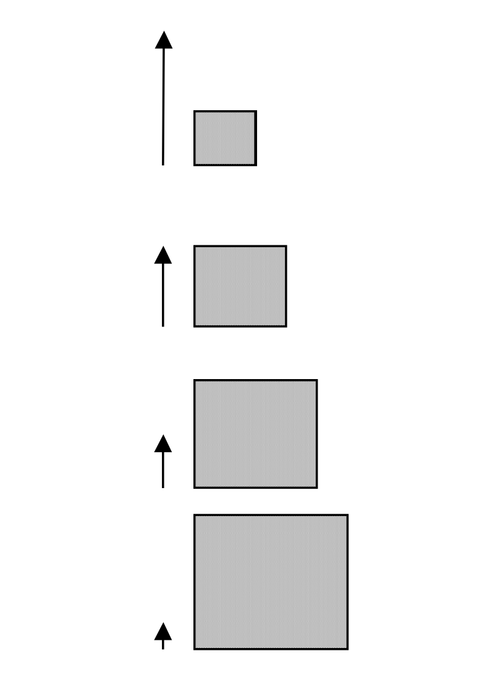

Energy and momentum is conserved. __Shock wave__ passing
    into lower density region transmits momentum to a progressively
    lower mass of material per unit surface area of the wave.
    
$$p=mv$$

Roughly same $p$ and smaller $m$ results in larger
    $v$. Low-density outer layers attain huge expulsion velocity.

## Energy Budget

    
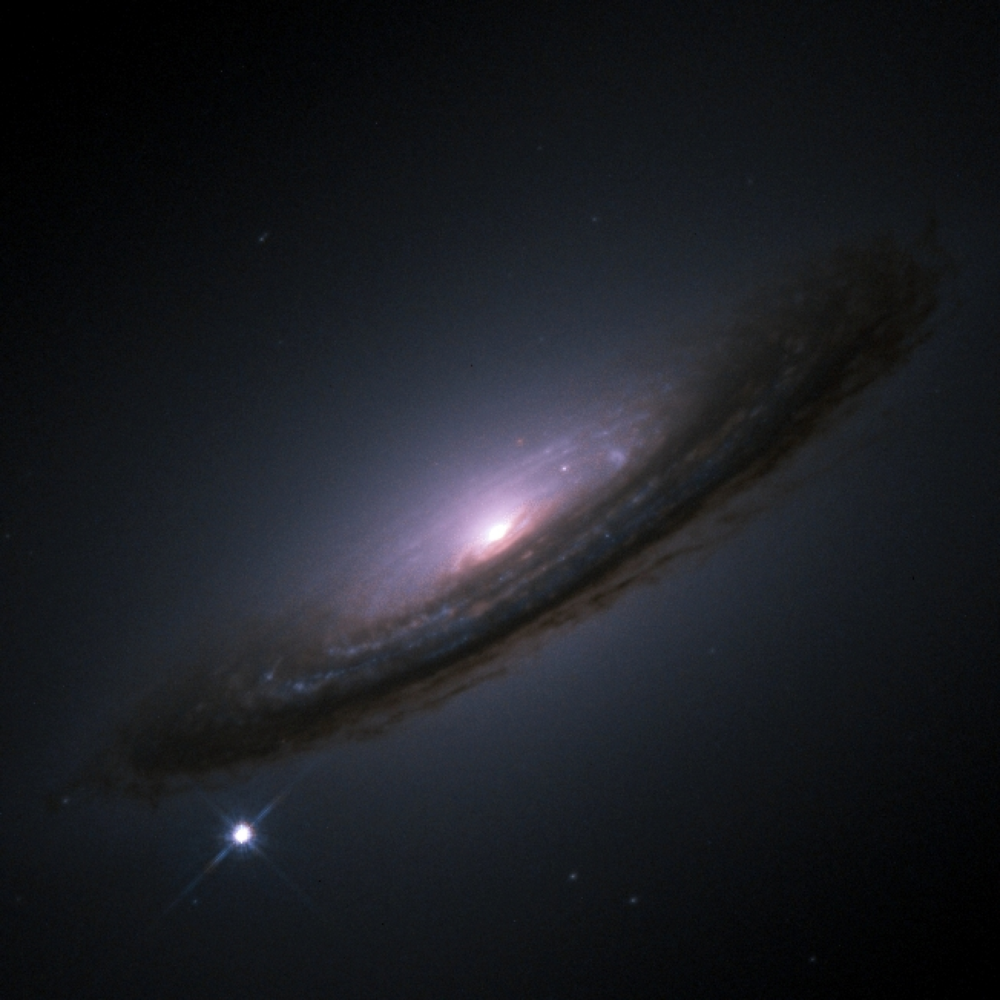

Observationally, supernovae brighten rapidly to $\sim
    10^{9}\,L_{\odot}$ in about 10 days, then slowly dim over about
    100 days, i.e. they may briefly outshine their entire host galaxy.

## Luminosity

 Energy source is the _release of gravitational potential energy_ by
  the contraction of the core.
  
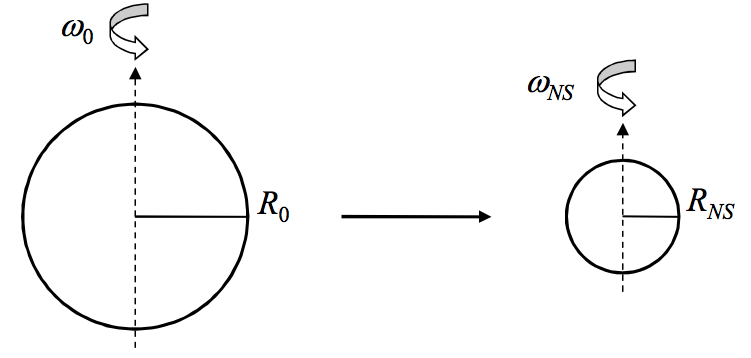

Gravitational potential energy of a uniform sphere is roughly
  \begin{equation}
    E=-\frac{GM^{2}}{r}\nonumber
  \end{equation}
  So energy released by contraction is roughly
  \begin{equation}
    \Delta
    E\approx\left(\frac{GM^{2}}{r_{1}}\right)-\left(\frac{GM^{2}}{r_{2}}\right)\nonumber
    \end{equation}
  and since $r_{1}\gg r_{2}$
  \begin{equation}
    \Delta
    E\approx \frac{GM^{2}}{r_{2}}\nonumber
  \end{equation}

- Using typical __neutron star__ values of $M=1.4M_{\odot}$ and $r_{2}=20$km, we find energy released $E\approx 10^{46}$ J.
- This is equivalent to $L_{\odot}$ emitted continuously for $10^{20}$ seconds, or $\sim 100$ times the Sun's total energy production over its Main Sequence lifetime, but in only $\sim 1/4$ second!
- About $2/3$ of released energy is reabsorbed in endothermic reactions.
- Most of remaining $1/3$ is released as neutrinos - about $10^{57}$ of them.
- About $1\%$ goes into kinetic energy of the _ejecta_.
- About $1\%$ goes into photons, with about $0.01\%$ as a visible flash.

- Supernovae produce __cosmic rays__ (extremely high energy particles, mostly protons but also some electrons and heavier nuclei).
- Supernovae distribute heavier elements into space, which are    then incorporated into new stars and planets. Some of the material    in the human body was ``cooked'' in supernovae.

- The supernova shock wave can disrupt interstellar gas clouds, perturbing their equilibrium and causing collapse and fragmentation -- new stars form, thus completing the cycle of stellar life.
- With roughly 2 supernovae per galaxy per 100 years, and about $10^{11}$ galaxies in the universe, there are on average about 50    supernovae per second!

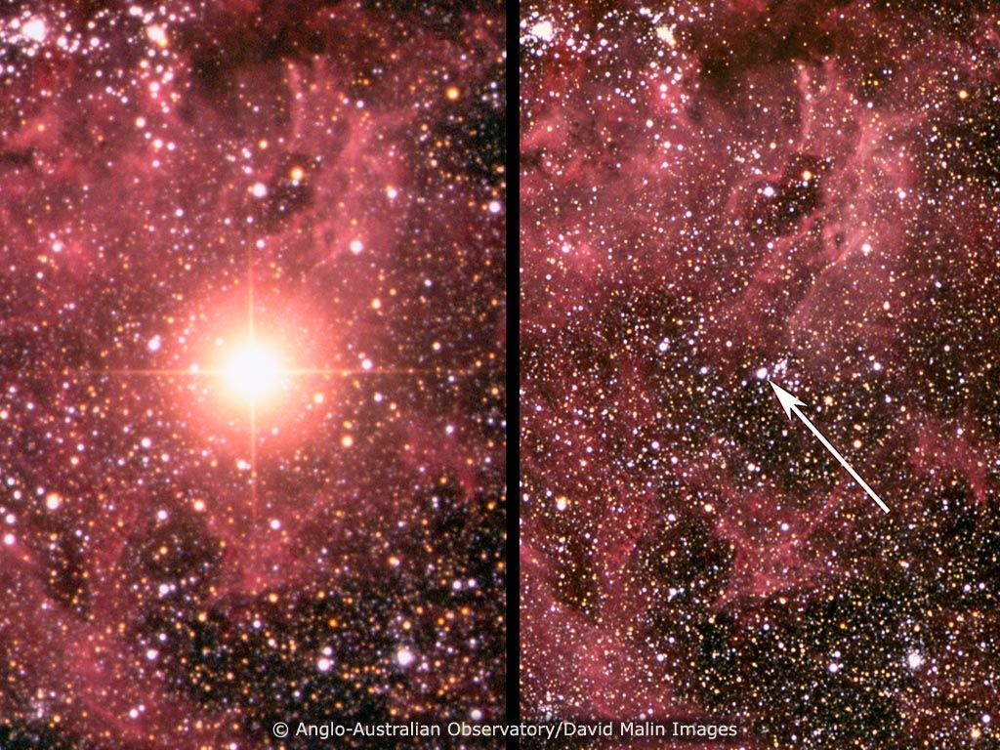

Supernova 1987A was the last supernova in our galaxy (actually in LMC satellite galaxy)

