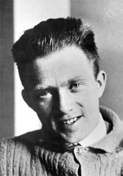
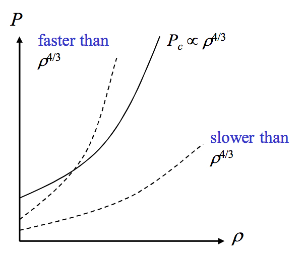
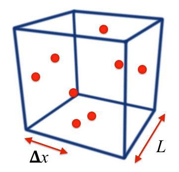
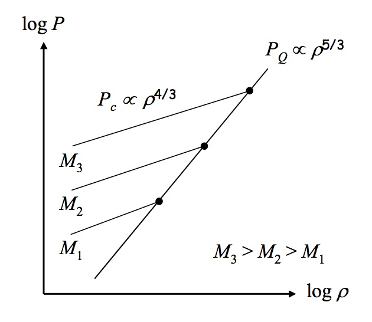

# Stellar fates

| ZAMS mass | Collapsing mass | Fate |
|-----------|-----------------|------|
| $\lesssim 8\,M_\odot$ | $1.4\,M_\odot$ | white dwarf |
| $8 - 25 M_\odot$ | 1.4 - 3 $M_\odot$ | Neutron Star |
| $\gtrsim 25 M_\odot$ | $\gtrsim 3 M_\odot$ | Black Hole |

- What keeps a White Dwarf star or Neutron Star from collapsing due to gravity?

Remember that no further energy can be obtained from nuclear fusion!

## Example: White Dwarf stars

- The typical size of the collapsed core is $\sim R_{\oplus}$
  $\rightarrow$ leading to average densities $>4\times 10^{6}$ that of
  the sun.
- Acceleration due to gravity at the surface of a White Dwarf is
  $\sim 5\times 10^{6}\,\text{m s}^{-2}$.
- A _teaspoon_ of White Dwarf material would weigh the equivalent of
  16 tons!
- In the gravitational field of the white dwarf it would be
  $8\times 10^{6}$ tons!

# Degenerate Matter

## Key players - 1926

Wolfgang Pauli: _Nobel prize 1945_, ``Not even wrong''

Sir Ralph Howard Fowler: Paul Dirac's PhD supervsior _(Dirac
and Schrodinger Nobel Prize 1933)_

Werner Karl Heisenberg: _Nobel prize 1932_

## The Pauli exclusion principle

- Allows at most one fermion (particle with 1/2 integer spin), such
as an electron or neutron, to occupy a given quantum state since no
two fermions can have the same set of quantum numbers.
- At zero temperature, all of the lower energy states and
none of the higher states are occupied $\rightarrow$ completely
degenerate.

## The Heisenberg uncertainty principle
 

$$
\Delta x\Delta p_x \approx \hbar\nonumber
$$

This means that a particle confined to a smaller and smaller volume of space will have
a corresponding larger and larger uncertainty in its momentum.

Note that $\hbar$ is Planck's constant ($h=6.626\times 10^{-34}$ Js)
divided by $2\pi$. 

# Degeneracy pressure

## A simplified model

For simplicity, we consider a _uniform spherical mass_ $M$ of radius $R$ and density $\rho$:
\begin{equation}
  \rho=\frac{M}{V}=\frac{M}{\frac{4}{3}\pi R^{3}}\nonumber
\end{equation}

This mass is composed of free electrons and protons (i.e. not bound
together in atoms) with mass $m_{\text{e}}$ and $m_{\text{p}}$ respectively. These each have a
number density $n_{\text{e}}$ and $n_{\text{p}}$, and since there is
charge-balance, $n_{\text{e}} = n_{\text{p}} =
n$. Therefore
\begin{equation}\label{eq:numberdens}
  \rho=n_{\text{e}}m_{\text{e}} + n_{\text{p}}m_{\text{p}}\approx nm_{\text{p}}\nonumber
\end{equation}
since $m_{\text{e}}\ll m_{\text{p}}$.

From _hydrostatic equilibrium_ (see SP 1) we know that the central
pressure $P_{\text{c}}$ required to support a body against its own
self-gravity is given by

\begin{align}
  P_{\text{c}}&=\frac{4 \pi}{3} G\rho^{2} \frac{R^{2}}{2} \\
  &={\left(\frac{\pi}{6}\right)^{1/3}GM^{2/3}\rho^{4/3}}
\end{align}

[ Since $\rho=M/(4/3)\pi R^3$ therefore $R^{2}=(M/(4/3)\pi\rho)^{2/3}$ ].

- In the stellar remnant, this central pressure must be balanced
  by the __cold pressure__, which we call _degeneracy pressure_.
- This is fundamentally a _quantum mechanical_ concept.

## Density vs pressure

- As the density of the stellar remnant increases, the central
    pressure due to self-gravity $P_{\text{c}}$ rises with density as
  $\rho^{4/3}$.
- The degeneracy pressure will only be able to balance
  this central pressure if it also increases with density, 
  and does so _faster_ than $\rho^{4/3}$.

## Back to the simplified model

- Let us consider a cubic metre of particles. If the number
    density is $n$, then this cube contains $n$ particles.
- By the _Pauli exclusion principle_ the particles must maintain
their identities as different particles $\rightarrow$ The uncertainty in
    their positions cannot be larger than their physical separation.

If the typical spacing between each particle is $\Delta x$, then each
    particle typically `occupies' a volume of $\langle V\rangle=(\Delta x)^{3}$, and

\begin{align}
			\Delta x &= \frac{1}{n^{1/3}}, \\
			n &= 1/{\langle V\rangle} \nonumber
\end{align}

  Therefore, by the _Heisenberg Uncertainty Principle_ each particle
  has a momentum in the $x$-direction of
  \begin{equation}
    p_{x}\approx\frac{\hbar}{\Delta x}\approx\hbar n^{1/3}\approx\hbar\left(\frac{\rho}{m_{\text{p}}}\right)^{1/3}\nonumber
  \end{equation}
  where we consider stationary, cold particles, with no thermal motion.

  For non-relativistic particles (i.e. particle speed $v\ll c$), the average
  kinetic energy of the particle is given by
  \begin{equation}
    \langle E \rangle = \frac{1}{2}m\langle v^{2}\rangle
    =\frac{\langle mv\rangle ^{2}}{2m}=\frac{\langle p^{2}\rangle
}{2m}=\frac{3\langle p_{x}^{2}\rangle }{2m}\nonumber
  \end{equation}
  where the non-relativistic particle momentum is $p=mv$ and $\langle\ldots\rangle$ indicates
  an average. Also $p^{2} = p_{x}^{2}+p_{y}^{2}+p_{z}^{2}$ therefore $\langle
p^{2}\rangle = 3\langle p_{x}^{2}\rangle$.

  Therefore the average quantum (or Fermi) energy of an electron is given by
  \begin{equation}\label{eq:eenergy}
   {\langle E_{\text{e}}\rangle =
\frac{3\hbar^2}{2m_{\text{e}}}\left(\frac{\rho}{m_{\text{p}}}\right)^{2/3}}\nonumber
  \end{equation}
  
  and for a proton by
  \begin{equation}\label{eq:penergy}
    {\langle E_{\text{p}} \rangle =
\frac{3\hbar^{2}}{2m_{\text{p}}}\left(\frac{\rho}{m_{\text{p}}}\right)^{2/3}}\nonumber
  \end{equation}

 Note some important properties of these equations
- They are only valid for _non-relativistic_ particles.
- Since $m_{\text{e}}\ll m_{\text{p}}$ we see that
    $\langle E_{\text{e}}\rangle \gg \langle E_{\text{p}}\rangle $ and we will show that electron
    pressure __dominates__ over proton pressure for White Dwarf stars.

# Pressure and kinetic energy

To find the degeneracy pressure, consider the work done by changing the volume of a box by an infinitesimal amount $d x$.
Pressure produces a force over the area of a face $A$, which changes the internal energy by:
\begin{align*}
				  d E & = - F d x \\
				  d E & = - (P A) d x
\end{align*}

$A d x = dV$ is an infinitesimal change in the volume of the box, so we can write

\begin{align*}
				  d E &= - P d V \\
				  P& = - \frac{d E}{d V}
\end{align*}
Pressure is a measure of energy per volume.

Pressure is a macroscopic quantity, but we can relate it to the quantum mechanics of degeneracy pressure
by considering the average kinetic energy per particle $\langle E \rangle$ and volume per particle $\langle V \rangle$.
\begin{align*}
 P&= -\frac{d \langle E \rangle}{d \langle V \rangle}
 \end{align*}
 We can now use ${\langle V \rangle}^{-1}=\rho / m_p$ to relate this to the particle energies $\langle E_e \rangle$ and $\langle E_p \rangle$.

## For electrons

Energy is 
\begin{align*}
				\langle E_e \rangle = \frac{3\hbar^2}{2m_e}\left(\frac{\rho}{m_p}\right)^{2/3} = \frac{3\hbar^2}{2m_e}{\langle V \rangle}^{-2/3} \nonumber
\end{align*}
and so the _partial pressure_ $P_{Qe}$ is
\begin{align*}
 P_{Qe}&= -\frac{3\hbar^2}{2m_e}\frac{d {\langle V \rangle}^{-2/3}}{d {\langle V \rangle}} \\
 &= -\frac{3\hbar^2}{2m_e} \times -\frac{2}{3}{\langle V \rangle}^{-5/3} \\
 &= \frac{\hbar^2}{m_e}\left(\frac{\rho}{m_p}\right)^{5/3}
\end{align*}

## And for protons:
\begin{align*}
	  P_{Qp}= \frac{\hbar^2}{m_p}\left(\frac{\rho}{m_p}\right)^{5/3}.
\end{align*}
In other words, we have $P = \frac{2}{3}n\langle E \rangle$.

\begin{align*}
				P_{Qe}= \frac{\hbar^2}{m_e}\left(\frac{\rho}{m_p}\right)^{5/3} \quad \quad
				P_{Qp}= \frac{\hbar^2}{m_p}\left(\frac{\rho}{m_p}\right)^{5/3}
\end{align*}

## Considerations

- Note that $T$ does not appear __anywhere__ in either equation implying
    that a finite temperature is not required to provide this source of
    pressure -- it is indeed a __cold pressure__.

- Note also that the degeneracy pressure varies with density as
    $\rho^{5/3}$. This is __faster__ than self-gravity, for which $P_{\text{c}}
    \propto \rho^{4/3}$.  So for some value of the density, the
    degeneracy pressure will become large enough to __balance__ the
    central pressure due to self-gravity.

# Visualising the pressure balance

A useful approach we can use is to take _logs of our pressure equations_ such that,
for the electron degeneracy pressure where $P_{\text{Qe}}\propto
\rho^{5/3}$, we have
\begin{align}
    \log(P_{\text{Qe}}) &= \log(\rho^{5/3}) + \text{constant}\nonumber\\
    &=\frac{5}{3}\log(\rho) + \text{constant}\nonumber.
\end{align}

For the central pressure due to self-gravity where
${P_{\text{c}}\propto \rho^{4/3}M^{2/3}}$ we have
\begin{align}
\log(P_{\text{c}}) &= \log(\rho^{4/3}) + \log(M^{2/3}) +
\text{constant}\nonumber\\
&=\frac{4}{3}\log(\rho) + \left(\frac{2}{3}\log(M) +
\text{constant}\right).
\end{align}
These equations define _straight lines_ in log space ($y = mx + c$). 

- The constant depends on the stellar remnant's mass, hence the same slope but different intercepts.
- For each mass a different value of $\rho$ is needed to balance $P_{\text{c}}$.
- Higher masses lead to higher central pressures which then require higher densities. 

