-------

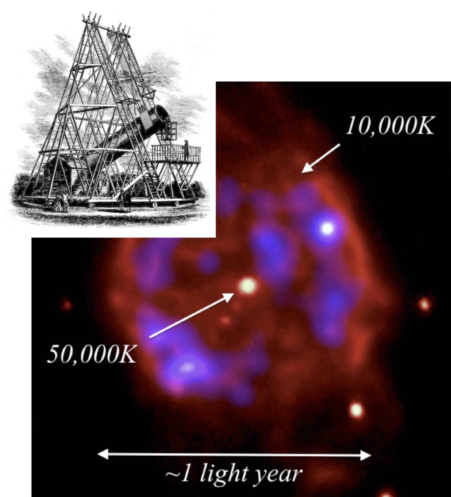

# White dwarfs on the HR diagram

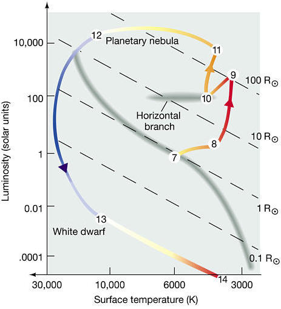

-  White dwarfs are made from the cores of stars with ZAMS mass $\leq 8$M$_{\odot}$.
-  There is not enough pressure to initiate fusion beyond helium burning.
-  At the end of the giant star phase it expels its surface layers as a planetary nebula.
-  Leaving the core exposed as a white dwarf star.
-  There is no supernova explosion.
   

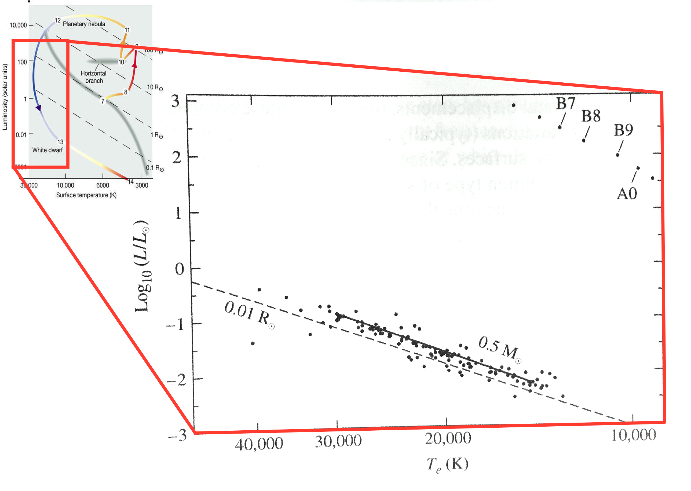
This figure shows real white dwarfs in the zoomed in panel. Observe that they follow the expected $L\propto T^4$ line of constant radius quite closely. This shows white dwarfs of different ages at different stages of cooling.

# Modeling white dwarfs

We have seen that the central pressure in a star is given by
\begin{equation}
  P_{\text{c}}=\left(\frac{\pi}{6}\right)^{1/3}GM^{2/3}\rho^{4/3}\nonumber
\end{equation}
and in a stellar remnant where both electrons and protons are \red{non-
relativistic}, the dominant degeneracy pressure is due to electrons,
given by
\begin{equation}
{P_{\text{Qe}}=\frac{\beta}{2} \frac{\hbar^{2}}{m_{\text{e}}}\left(\frac{\rho}{m_{\text{p}}}\right)^{5/3}}\nonumber
\end{equation}
where $\beta$ is a dimensionless constant of order unity.

(For the idealised case we considered in Lecture 2.2,  we assumed $\beta = 2$).

__A stellar remnant where the self-gravity is balanced by electron
degeneracy pressure is called a white dwarf__.

## White dwarf density

Equating $P_{\text{Qe}}$ and $P_{\text{c}}$, we have (solving for the density)
\begin{align}
  \frac{\beta}{2}\frac{\hbar^{2}}{m_{\text{e}}}\left(\frac{\rho}{m_{\text{p}}}\right)^{5/3}&=\left(\frac{\pi}{6}\right)^{1/3}GM^{2/3}\rho^{4/3}\nonumber\\
      \rho^{1/3}&=\left(\frac{\pi}{6}\right)^{1/3}GM^{2/3}\frac{2}{\beta}\frac{m_{\text{e}}}{\hbar^{2}}m_{\text{p}}^{5/3}\nonumber\\
\rho_{\text{WD}}&=\frac{4\pi}{3\beta^{3}}G^{3}\frac{m_{\text{e}}^{3}m_{\text{p}}^{5}}{\hbar^{6}}M^{2}\nonumber
\end{align}

- Hence the density of a white dwarf depends on the __square of its mass__.
- Calculating out the constants, we find that the density of a white dwarf $\rho_{\text{WD}}$ is about $10^{7}$ times greater than the density of water, i.e. $\rho_{\text{WD}}\approx 10^{10}\,\text{kg m}^{-3}$.
- So 1 cm$^{3}$ of white dwarf material weighs about 10 tons!

## White dwarf radius

What is the radius of a white dwarf star? 

Substitute
    \begin{equation}
      \rho=\frac{M}{\frac{4}{3}\pi R^{3}}\nonumber
    \end{equation}
    into the previous equation and solve for the radius
    \begin{align}
      \frac{M}{\frac{4}{3}\pi
        R^{3}}&=\frac{4\pi}{3\beta^{3}}G^{3}\frac{m_{\text{e}}^{3}m_{\text{p}}^{5}}{\hbar^{6}}M^{2}\nonumber\\
      \frac{1}{R^{3}}&=\left(\frac{4\pi}{3}\right)^{2}\left(\frac{G}{\beta}\right)^{3}\frac{m_{\text{e}}^{3}m_{\text{p}}^{5}}{\hbar^{6}}M\nonumber\\
      R&=\left(\left(\frac{4\pi}{3}\right)^{2}\left(\frac{G}{\beta}\right)^{3}\frac{m_{\text{e}}^{3}m_{\text{p}}^{5}}{\hbar^{6}}M\right)^{-1/3}\nonumber\\
      R_{\text{WD}}&=\left(\frac{3}{4\pi}\right)^{2/3}\frac{\beta}{G}\frac{\hbar^{2}}{m_{\text{e}}m_{\text{p}}^{5/3}}M^{-1/3}\nonumber 
    \end{align}

- Note that the radius of the white dwarf depends only on some universal constants and its mass, $M$.
- Note also an important property - the radius is inversely proportional to the cube root of the mass $\rightarrow$ _a more massive white dwarf is smaller than a less massive white dwarf!_

To make the radius expression easier to use, we can multiply out
the constants to give the radius of a white dwarf in metres as a
function of its mass in solar masses.

\begin{align}
     R_{\text{WD}}&=2.986\times 10^{16}M^{-1/3}\,\text{m}\nonumber\\
     R_{\text{WD}}&=2.986\times
     10^{16}\left(\frac{M}{M_{\odot}}\right)^{-1/3}M_{\odot}^{-1/3}\,\text{m}\nonumber\\
     R_{\text{WD}}&\approx 2\times
10^{6}\left(\frac{M}{M_{\odot}}\right)^{-1/3}\,\text{m}\nonumber
\end{align}

A white dwarf has the mass of the Sun in roughly the volume of the Earth.

# Summary of white dwarf properties

- Mostly carbon, some oxygen (inert former stellar core).
- Supported by electron degeneracy pressure.
- Much leftover gravitational energy from collapse, so very hot. $5,000 > T > 80,000$ K - glows in a range of colours.
- Very small ($\sim 10^{6}$ m), so very dim: $\sim 10^{-3}$ to $10^{-4} L_{\odot}$.
- Very high density: $\sim 10^{7}$ to $10^{11} \text{kg m}^{-3}$.

White dwarfs have no energy sources, so energy radiated to space
is not replenished. White dwarfs cool down completely over very
long timescales. When the white dwarf reaches ambient temperature
it no longer shines, and is called a black dwarf.
    

# Chandrasekhar mass limit

Named after Subrahmanyan Chandrasekhar: Nobel prize 1983

We have shown that
\begin{equation}
  R_{\text{WD}}\propto M^{-1/3}\nonumber
\end{equation}

- So, as $M$ increases $\rightarrow$ $R$ decreases $\rightarrow$
$\rho$ increases $\rightarrow$ particles confined to smaller
volumes $\rightarrow$ particle speeds increase (by HUP)
$\rightarrow$ particle speeds approach $c$ $\rightarrow$
_non-relativistic particle approximation fails_.
- We must consider more carefully what happens when the electrons become
relativistic, and how this will affect the degeneracy pressure.

When does the non-relativistic approximation fail? When
    \begin{align}
      v&\rightarrow c\nonumber\\
      p=mv&\rightarrow mc\nonumber
    \end{align}
    We know from the Heisenberg uncertainty principle that
    \begin{equation}
      p_{x}\approx\frac{\hbar}{\Delta x}\approx\hbar \left(\frac{\rho}{m_{\text{p}}}\right)^{1/3}\nonumber
    \end{equation}
    So at the Chandrasekhar mass limit 
    \begin{equation}
      p\approx\hbar \left(\frac{\rho}{m_{\text{p}}}\right)^{1/3}\approx m_{\text{e}}c\nonumber
    \end{equation}

From our expression for the White Dwarf density we can now write
    \begin{equation}
      \hbar\left(\frac{1}{m_{\text{p}}}\frac{4\pi}{3\beta^{3}}G^{3}\frac{m_{\text{e}}^{3}m_{\text{p}}^{5}}{\hbar^{6}}M^{2}\right)^{1/3}\approx
m_{\text{e}}c\nonumber
    \end{equation}
    We rearrange and solve for the stellar mass, $M$, to give
    \begin{align}
      \hbar^{3}\frac{1}{m_{\text{p}}}\frac{4\pi}{3\beta^{3}}G^{3}\frac{m_{\text{e}}^{3}m_{\text{p}}^{5}}{\hbar^{6}}M^{2}&\approx
    m_{\text{e}}^{3}c^{3}\nonumber\\
    \frac{4\pi}{3\beta^{3}}G^{3}\frac{m_{\text{p}}^{4}}{\hbar^{3}}M^{2}&\approx
    c^{3}\nonumber
    \end{align}

\begin{equation}
M_{\text{Ch}}\approx\left(\frac{3}{4\pi}\right)^{1/2}\frac{1}{m_{\text{p}}^{2}}\left(\frac{\beta\hbar
        c}{G}\right)^{3/2}\nonumber
    \end{equation}

- $M_{\text{Ch}}$ is called the Chandrasekhar Mass Limit, and is the __maximum mass__ that a white dwarf can be.
- Calculating out the constants, we find $M_{\text{Ch}} \approx 0.9 M_{\odot}$.
- Note a more detailed calculation gives $M_{\text{Ch}} \approx 1.44 M_{\odot}$ - this is the canonical value.
- Also notice that this limit _only_ depends on a handful of known physical constants.

## What  happens above the Chandrasekhar mass limit?

Electrons are relativistic, so we need to use the relativistic
energy equation:
    \begin{equation}
      E^{2}=p^{2}c^{2}+m_{0}^{2}c^{4}\nonumber
    \end{equation}
where $E$ is the total energy of the particle, $m_{0}$ is its rest mass,
and $p$ is now the relativistic momentum.
    

At high speeds ($v\rightarrow c$), the kinetic energy dominates
over the rest-mass energy, so
    \begin{equation}
      E\approx pc\nonumber
    \end{equation}

Using the general thermodynamic relation as before, we find that
    the quantum degeneracy pressure due to relativistic electrons is
    given by
    \begin{equation}
      P_{\text{QeR}}\propto
      nE_{\text{eR}}\propto\frac{\rho}{m_{\text{p}}}E_{\text{eR}}\propto\frac{\rho}{m_{\text{p}}}pc\propto\rho^{4/3}\nonumber
    \end{equation}
    
$p\propto \rho^{1/3}$ comes from the HUP.
    Degeneracy pressure now varies with density as $\rho^{4/3}$, not
    $\rho^{5/3}$ as before.

## How does this affect the pressure-density graph?

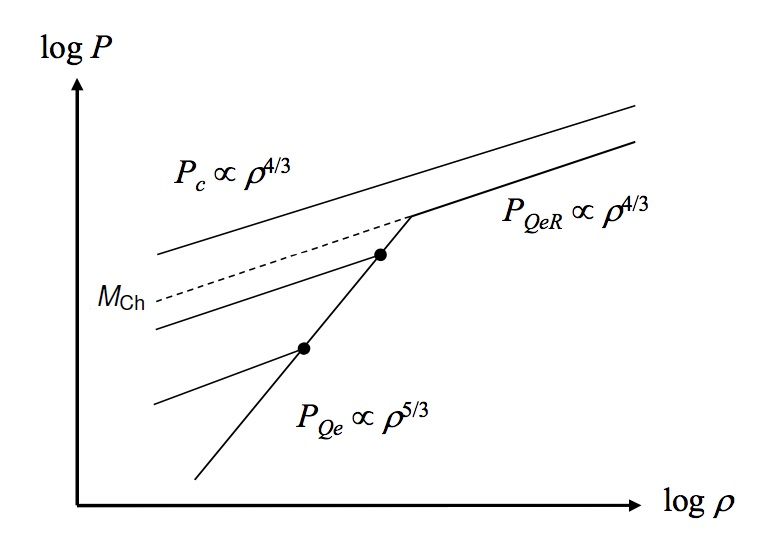

When the electrons become relativistic, the slope of the
        degeneracy pressure curve changes from $5/3$ to $4/3$.

Above the Chandrasekhar mass, the curves for the central
pressure due to self-gravity, $P_{\text{c}}$, and the relativistic
electron degeneracy pressure, $P_{\text{QeR}}$, are __parallel__. Therefore,
these curves will no longer intersect.

So above $M_{\text{Ch}}$, there is no value of $R$ for which $P_{\text{QeR}}$
balances $P_{\text{c}}$. No equilibrium is possible, and so the stellar
remnant will continue to contract under its own gravity. 

It will continue to shrink past the conditions for a white dwarf
until some pressure source _other_ than electron degeneracy
pressure can counteract the self-gravity.

- This pressure source is _neutron degeneracy pressure_.
- It too is overcome above the _Tolman-Oppenheimer-Volkoff limit_ - see SP2.4 lectures.

# Observational Properties of White Dwarfs

## Do white dwarfs actually exist?

- Yes, we can see them.

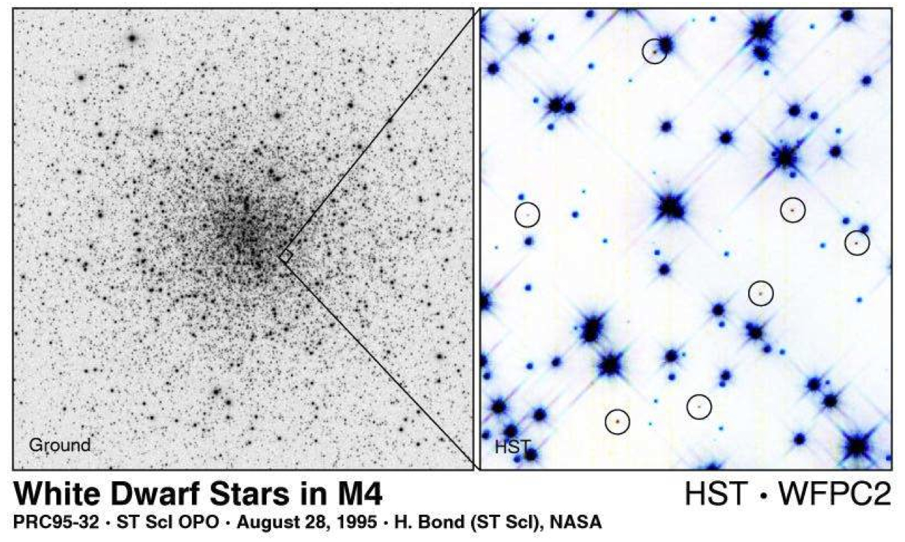

- Although very faint, they can be observed directly with a telescope
- We can use our knowledge from SP1 to infer the physical properties in the same way we did for main sequence stars.

Measuring the amount of light we receive from a white dwarf
 gives us its apparent magnitude, $m$. If we can determine the
 distance, $d$, to the star (by parallax etc),
 we can then work out its absolute magnitude,
 $M$, using the distance modulus formula from SP1:
 
\begin{equation}
   M=5\log_{10}d + m -5
\end{equation}
      
The absolute magnitude then gives us the star's luminosity,
$L$, from Pogson's equation:
\begin{equation}
   M-M_{\odot}=-2.5\log_{10}\left(\frac{L}{L_{\odot}}\right)\nonumber
\end{equation}

- If we examine the spectrum of the light we receive from the star (and assume it emits like a blackbody), we can determine the temperature of the white dwarf using Wien's Displacement Law:
\begin{equation}
\lambda_{\text{max}}T=b\hspace{1cm}b=2.898\times 10^{- 3}\,\text{m K}\nonumber
\end{equation}
- If we have $L$ and $T$, we can then obtain the radius of the star, $R$, using the Stefan-Boltzmann law:
\begin{equation}
L=4\pi R^{2}\sigma T^{4}\nonumber
\end{equation}
- If the star is in a binary system, we can also work out its mass from observations of its orbital motion.
- We can then determine the mean stellar density, and whether the white dwarf stars we observe follow our derived $R \propto M^{-1/3}$
  relation.

## What do the observations tell us?

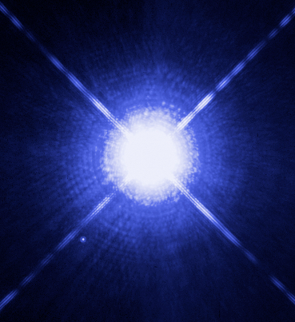

Take as an example the most famous white dwarf, __Sirius B__, the binary companion of Sirius A.

| Observed Properties | value | note |
|---------------------|-------|------|
| m | 8.44 | apparent magnitude |
| d | 2.64 pc | distance (via parallax) |
| T | 25200 K | Temperature (via Wien's law) |

- The orbital period is 50.09 years, and system is a visual binary,
so orbital parameters can be observed directly: orbital separation ranges
between $8$--$32$ AU; ratio of the distances of each star from the
centre-of-mass $r_{1}/r_{2} = 0.466$.
- Binary observations give a mass 0.98$M_{\odot}$ = $1.95\times 10^{30}$kg.
- It was realised in 1915 that this is a hot blue-white star.  Initially
this was thought to be "absurd". 

__Exercise__: Calculate the absolute magnitude $M$, luminosity $L$, radius $R$ and density $\rho$ of Sirius B.

Using these values, we can find:
\begin{align}
        M&=11.18\nonumber\\
        L&=0.023L_{\odot}\nonumber\\
        R&=0.008R_{\odot}=5.7\times 10^{6}\,\text{m}\nonumber\\
        \rho&=2.5\times 10^{9}\,\text{kg}\,\text{m}^{-3}\nonumber
\end{align}

- Hence Sirius B is about the size ($\sim 10^{6}$ m), density
 ($\sim 10^{9}$ kg m$^{-3}$), and temperature ($>10,000$ K) we
 expect for a white dwarf.

## Another example: 40 Eridani B

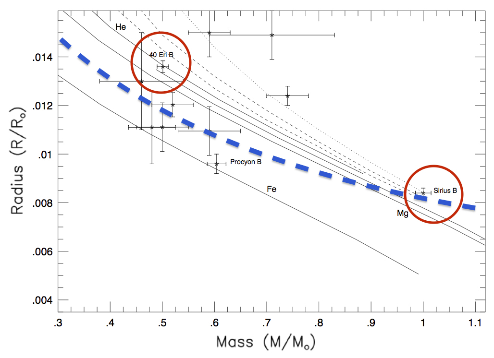

The first white dwarf to be observed, by William Herschel in 1783.

\begin{align}
        L&=0.013L_{\odot},\hspace{0.2cm}R=0.014R_{\odot}\nonumber\\
        M&=0.5M_{\odot},\hspace{0.2cm}T=16,500\,\text{K}\nonumber
\end{align}

- Taking mass and radius ratios with Sirius B, we find
\begin{equation}
\frac{R_{1}}{R_{2}}=\left(\frac{M_{1}}{M_{2}}\right)^{-0.61}
\end{equation}
- Theoretically, the index should be $-0.33$, so the agreement isn't 
  too bad (and the sign is correct!). Observations of other white
    dwarfs broadly confirm the relationship (but with large uncertainties).

## Accretion

Stellar remnants in close binary systems may gravitationally
    attract material away from their companion stars. This material
    flows onto the surface of the remnant in a process called _accretion_.

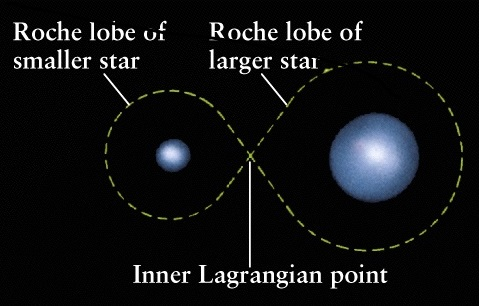
Consider the gravitational potential in a binary
system. The region of space around a star in which material is
gravitationally bound to that star is called its Roche Lobe. 

In a binary system, these touch at the system's
Lagrange point where the gravitational effect of each
star exactly balances.

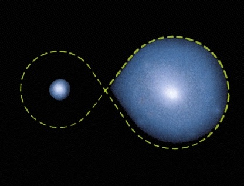

Suppose that one member of the binary system is a compact
object (e.g. a _white dwarf_), and that the other member
is large enough (e.g. a _giant star_) or close enough that
it completely fills its own _Roche Lobe_. 

Matter will "spill across" from the companion star's Roche Lobe at the
_Lagrange point_, stream into the white dwarf's Roche Lobe and fall towards the white dwarf.

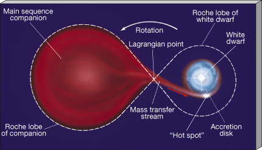

Since the whole system is rotating (as the stars orbit around each other), the flowing stream of matter possesses _angluar momentum_.

Therefore, it doesn't fall directly down onto the white dwarf, but misses the surface and swings
around it, _orming a spiral of in-falling matter_.

- Particles feed down into the orbital plane from above and
below, so collisions between particles cancel out the component of
momentum perpendicular to the orbital plane.
- However, the particles are streaming parallel to the orbital
    plane (flowing from one star to the other), so the component of momentum parallel to the orbital plane is conserved.
- The net effect is that the spiraling flow flattens itself into a thin __accretion disc__ in the plane of the orbit (c.f. Solar System Physics).
- Collisions between particles in the accretion disc cause friction, which heats up the gas and makes it glow. The glowing accretion disc can be observed telescopically.

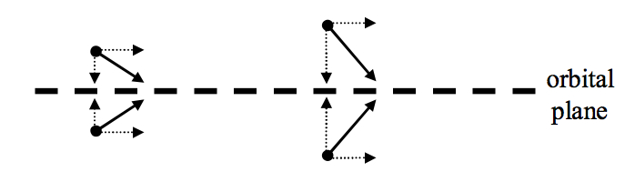

## Example system: Mira

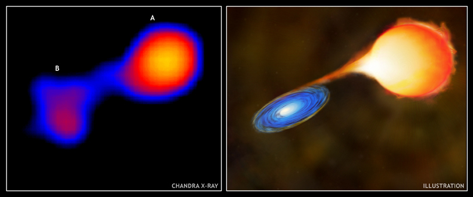
_Mira system in X-rays, and artist's impression Image credit: NASA/CXC/SAO/ M. Karovska et al., M. Weiss_
        
This system contains a giant star in a ~400 year orbit with a
white dwarf and lies at a distance of about 90 parsecs.

## Energy source for this emission

- Release of gravitational potential energy during the in-fall.
- By a similar argument to the one we used to calculate energy release in a supernova (see Lecture 2.1), we can see that the gravitational potential energy released by a mass $m$ falling onto a body of mass $M$, radius $R$, from a height $\gg R$ is
\begin{equation}
    E\approx\frac{GMm}{R}
\end{equation}

- The accretion luminosity is then given by
\begin{equation}
  L_{\text{acc}}=\frac{dE}{dt}=\frac{GM}{R}\frac{dm}{dt}=\frac{GM}{R}\dot{m}
\end{equation}
where $\dot{m}$ is the _mass accretion rate_ (kg s$^{-1}$).

- If we assume the accretion disc radiates like a __blackbody__, we can relate the disc accretion luminosity to the disc temperature $T_{\text{d}}$ using the Stefan-Boltzmann law:
\begin{equation}
L_{\text{acc}}=A\sigma T^{4}_{\text{d}}
\end{equation}

- Since the emitting area $A$ is both sides of a flat disc, rather than the usual sphere, the emitting area for an accretion disc of radius $R_{\text{d}}$ is
\begin{equation}
      A=2\pi R^{2}_{\text{d}}\nonumber
\end{equation}

- Equating our expressions for luminosity we find
\begin{equation}
L_{\text{acc}}=\frac{GM\dot{m}}{R}=2\pi
R_{\text{d}}^{2}\sigma T^{4}_{\text{d}}
\end{equation}

\begin{equation}
      L_{\text{acc}}=\frac{GM\dot{m}}{R}=2\pi
      R_{\text{d}}^{2}\sigma T^{4}_{\text{d}}\nonumber
\end{equation}

__Accretion discs__ are usually observed in X-rays, giving $T_{\text{d}}\approx
      10^{6}$ K.  Orbital measurements of the binary system can give $M$,
      and thus $R$ from the mass-radius relationship. If the disc can be
      resolved, $R_{\text{d}}$ can be determined, thus allowing us to calculate $\dot{m}$
      from measurements of $L_{\text{acc}}$.

## Novae

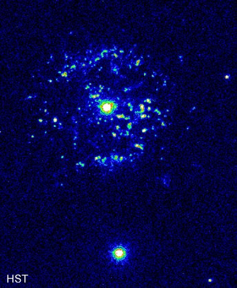

    <list>
        <li>
Accretion transfers hydrogen on to the white dwarf. This mass ``piles up'' on the surface, and the weight of this overlying material causes the local density to increase. Eventually the density (and therefore pressure and temperature) becomes sufficiently high for _H-fusion_ to begin.

<li>
This fusion releases a large amount of energy, causing a sudden bright outburst of emission - a <b>nova</b>. This thermonuclear explosion temporarily sweeps away the accretion disc: when it builds up again sufficiently, another nova occurs.
        </list>
    

## Supernovae

- If the mass of an accreting carbon white dwarf approaches    $M_{\text{Ch}}$, the density within the star becomes      sufficiently high that rapid carbon fusion can begin throughout       the entire star - a _carbon detonation supernova_ (Type 1a). 
- This     is probably sufficiently violent that it disrupts the entire      star, gravitationally unbinding it and blowing it apart: a      stable neutron star probably never gets a chance to form.

### SN 1572 - Tycho's supernova

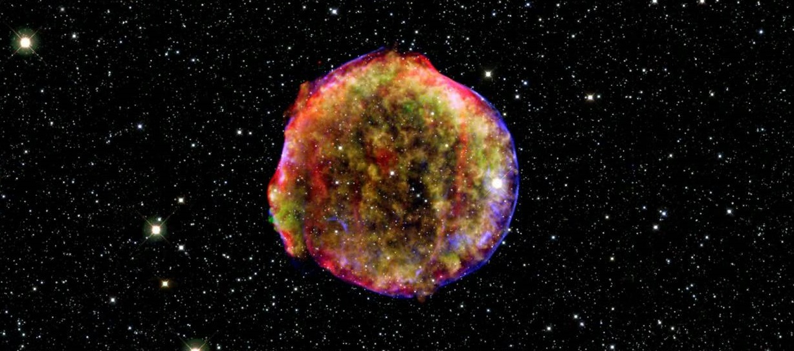

